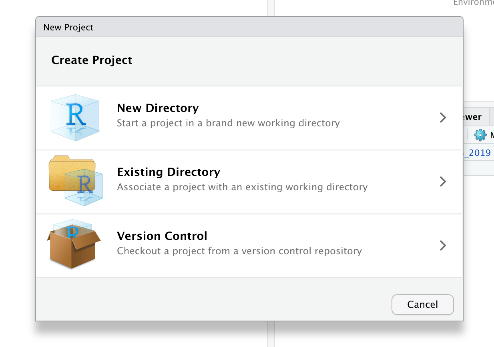
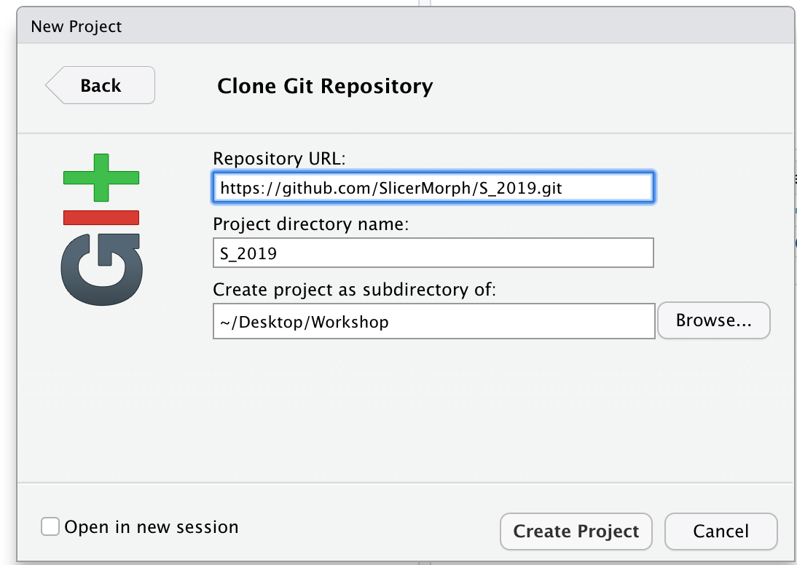
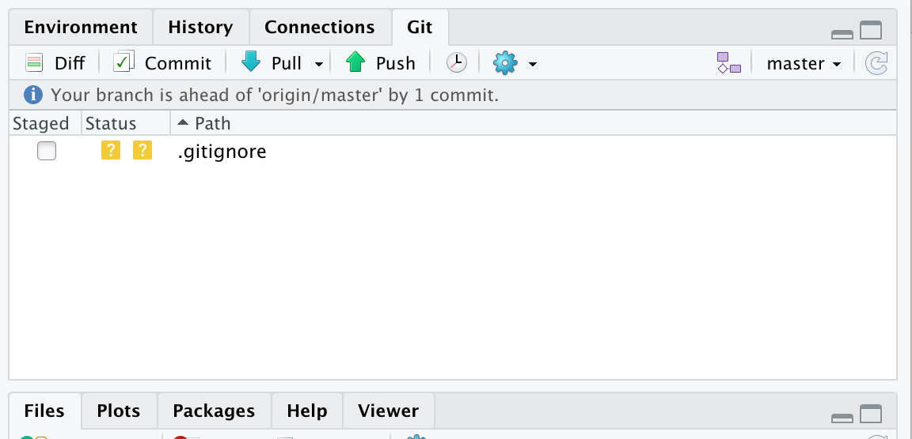
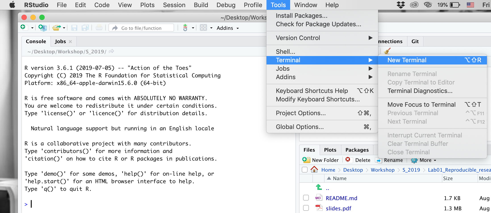
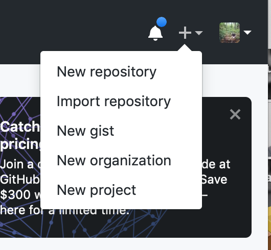
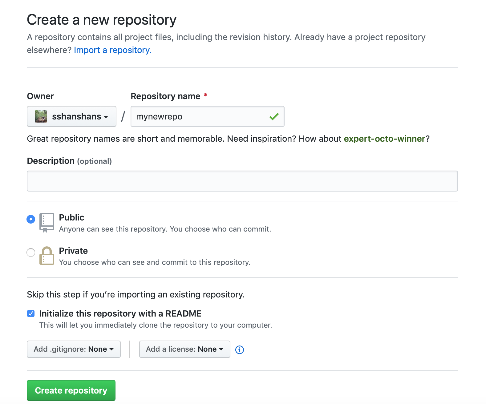
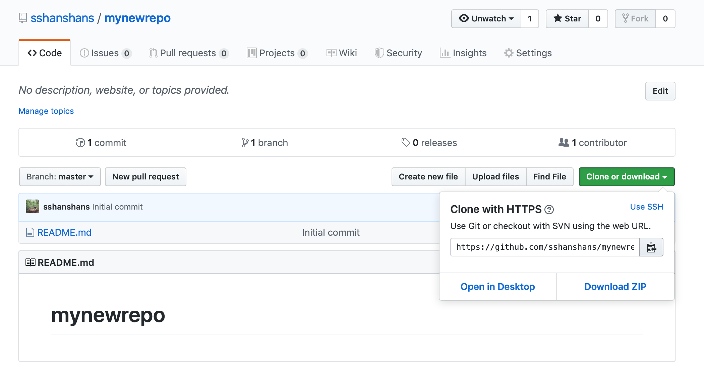
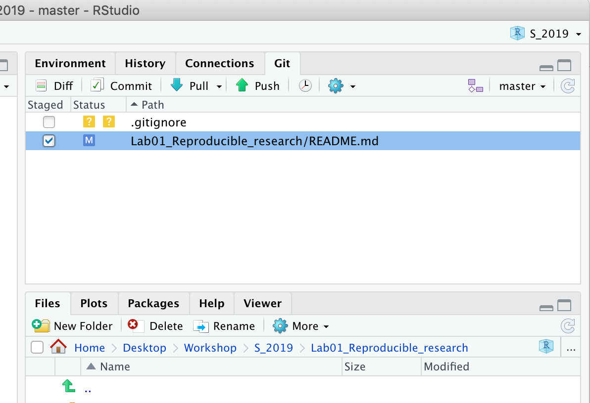
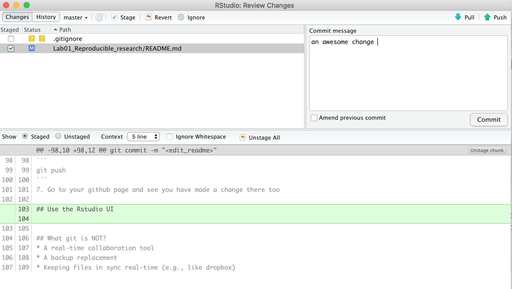
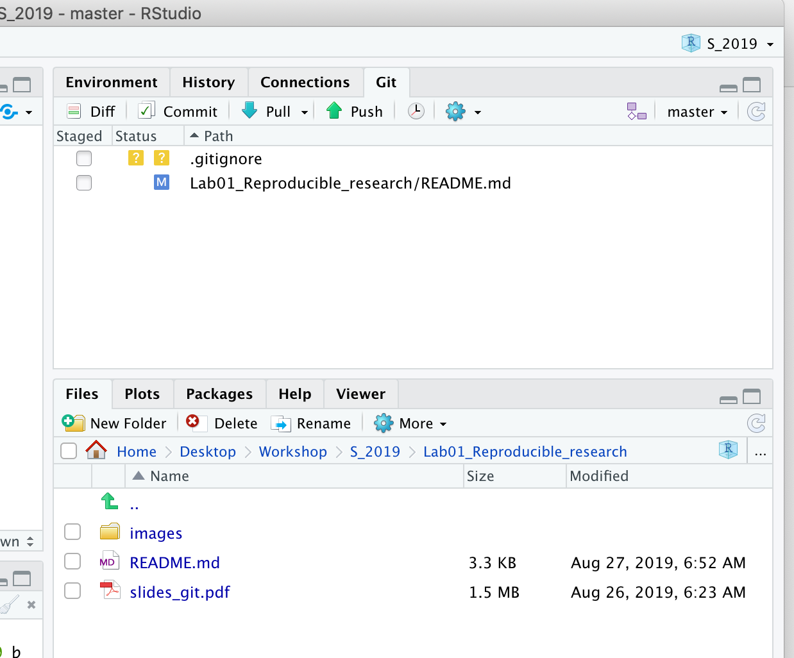

# Lab 01 Tools for reproducible research
### Date: 08/26
### Time: 45 minutes

## Objectives 
* become familiar with Rstudio’s Git and Github integration
* be able to pull course materials from the workshop github page
* be able to use simple Markdown syntax to highlight text (all tutorials in the workshop were written using Markdown syntax).

## Why use git?
* [Git is useful to avoid this](http://phdcomics.com/comics/archive.php?comicid=1323)
* [While there is some truth in it, we want don't want to be in this situation either](https://xkcd.com/1597/)

## Three tools 
* git/github (command line)
* Rstudio (UI driven, after a repository is created)
* Markdown syntax

## Prerequisite
Download and install

* [R 3.6.2](https://cran.r-project.org/)
* [Rstudio desktop](https://www.rstudio.com/products/rstudio/download/)
* [git](https://git-scm.com/downloads): you might already have git installed if you have macOS or Linux. [This](https://happygitwithr.com/install-git.html) is a very nice tutorial on how to install. 

In case you run into trouble when using Git in Rstudio, try reset the git path in R: tools --> global options --> git --> path to git.exe

## Outline
* Version control with Git and Github
* Use Git in Rstudio
* A first pull from SlicerMorph/S_2019
* Create your own project on Github and a first push by Rstudio
* Markdown: a way to style text

## Exercise 1: A first pull from SlicerMorph using Rstudio Git UI

1. In Rstudio, create a new version control project: File -> New Project -> Version Control



2. Clone Git repository.  In *Repository URL* type
```
https://github.com/SlicerMorph/S_2019.git
```


3. In the Git tab, click the *pull* button



Alternatively, if you are more comfortable with using command line, you could try the following,

3. Open a new terminal: Tools -> Terminal -> New Terminal



4. Type in the terminal
```
git pull
```

## Exercise 2: Create your own project on Github and make it talk to Rstudio
1. Log in to your Github account and create a new repository. There is a small "+" sign right next to your profile picture



2. Fill in the information about your new repository. I usually select the option *Initialize this repository with a README*. Once you are finished, click *Create repository*



3. Copy the URL of your new repository



4. Pull from your new repository using Rstudio as in Exercise 1. 

## Exercise 3: Make a first change in your new repository
1. Open the *Readme.md* file in Rstudio. 

2. Type a descriptive paragraph about your project. Or just an emoji, like :pig:. 

3. Save your *Readme.md* file and close it.

4. In the git tab, Your *Readme.md* is now `modified`. Click on the checkbox in front of the file name. 



5. Click the *commit* button and enter a description your changes (for you to remember when looking at the commit history)



6. Now you are ready to `push` this to the remote repository (you will have to enter your username and password)



7. Go to your github page and see you have made a change there too

Alternatively, you can also accomplish the same steps using the terminal window, or the git command line syntax.

4. Go to the terminal in Rstudio and type in the terminal
```
git add *
```

5. Commit your change to git
```
git commit -m "<edit_readme>"
```
*-m* allows you to edit a customized commit message to describe what you have added/changed in the repository.

6. Push your change to the remote repository
```
git push
```

## Exercise 4: Markdown syntax 
Read some examples from the [Markdown syntax](https://guides.github.com/features/mastering-markdown/). Pick three of your favorite features and use them in the *Readme.md* file. Push your change to the remote repository on Github. 

## What git is NOT?
* A real-time collaboration tool
* A backup replacement
* Keeping files in sync real-time (e.g., like dropbox)
* Not good with binary files (office documents, pdfs, pictures, etc)

## Resources
* [Resources to learn Git by Github](http://try.github.io)
* [Git Book](https://git-scm.com/book/en/v2)
* [Git Reference](https://git-scm.com/docs)
* [Markdown syntax](https://guides.github.com/features/mastering-markdown/)

