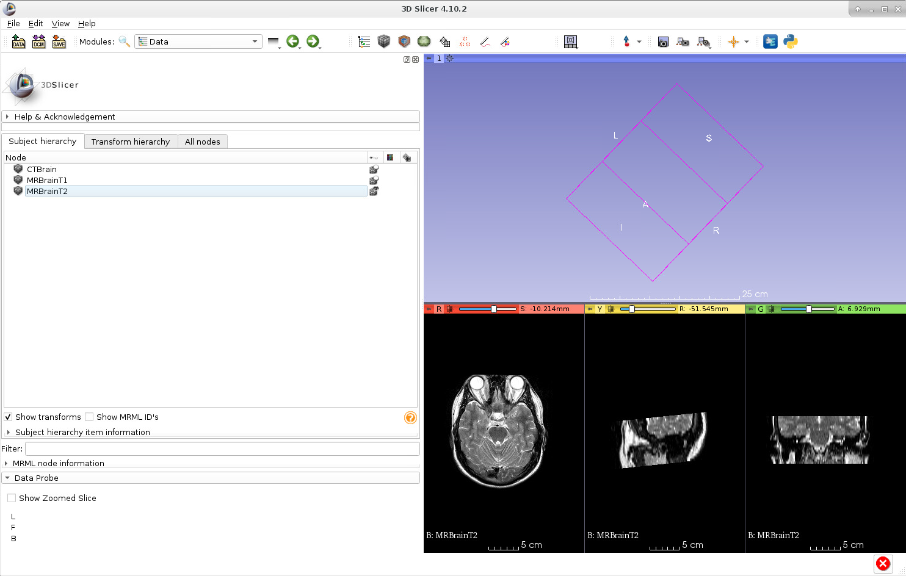
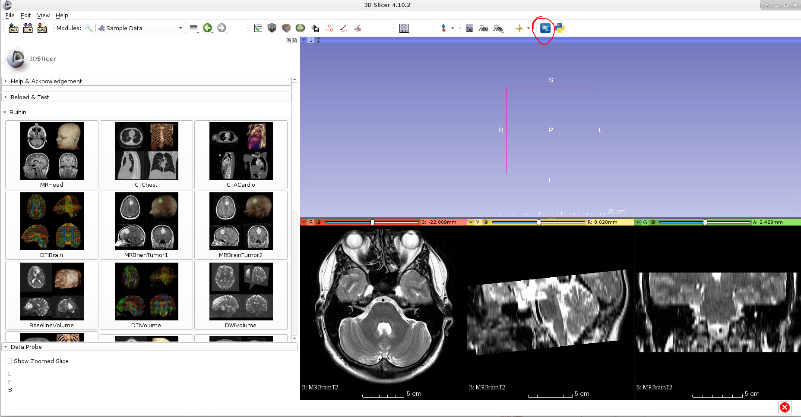
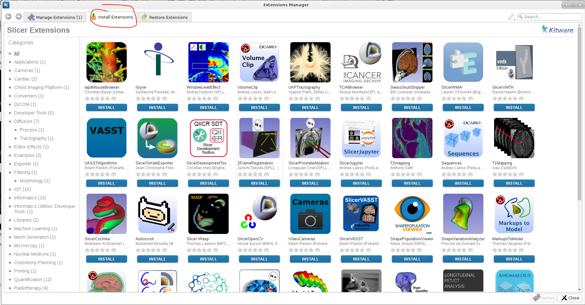
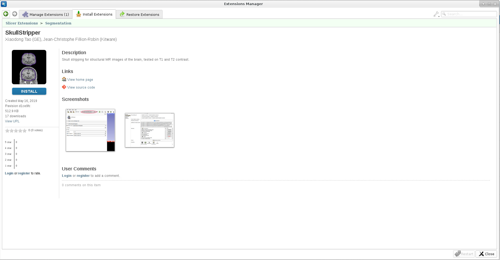
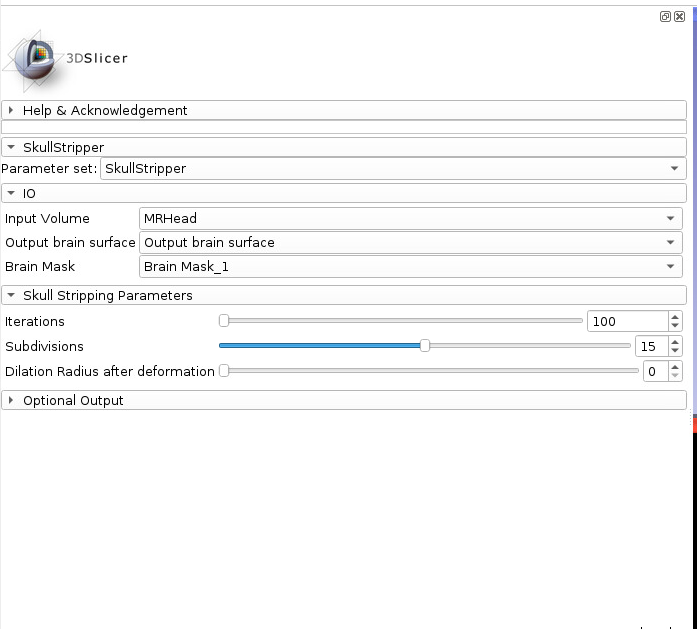
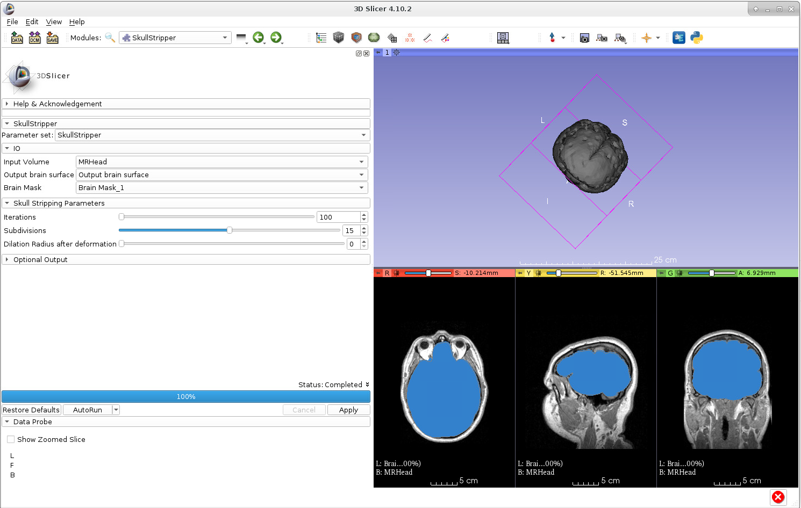
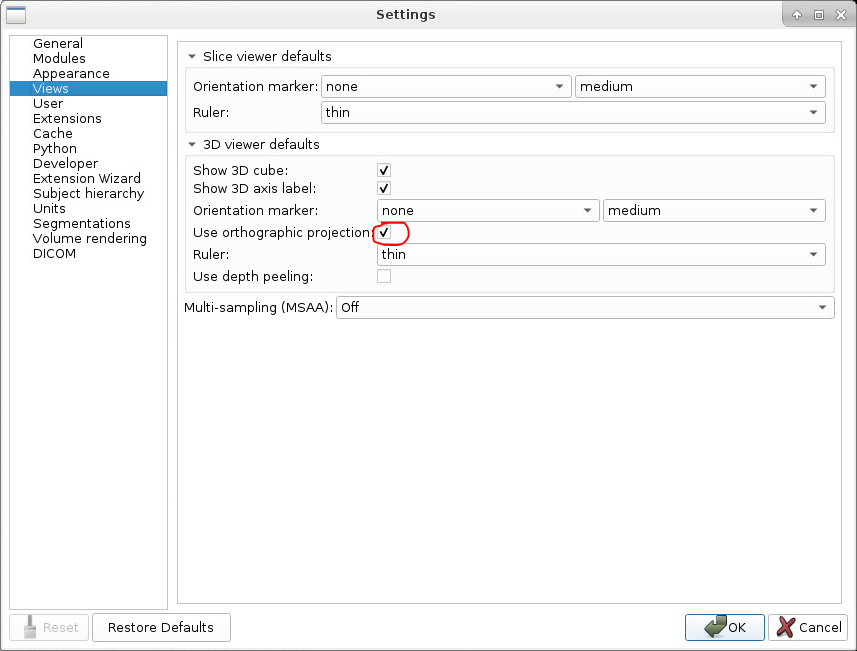
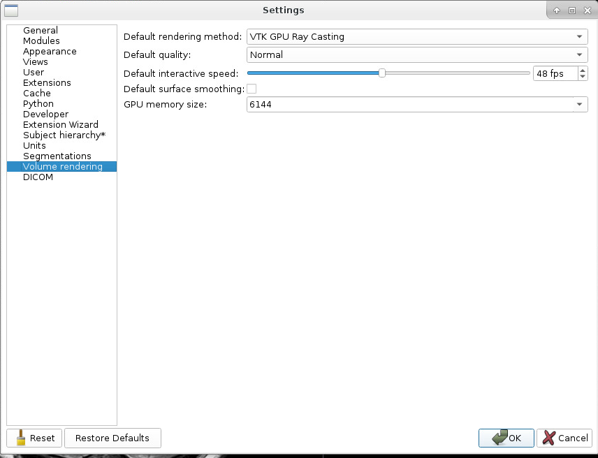
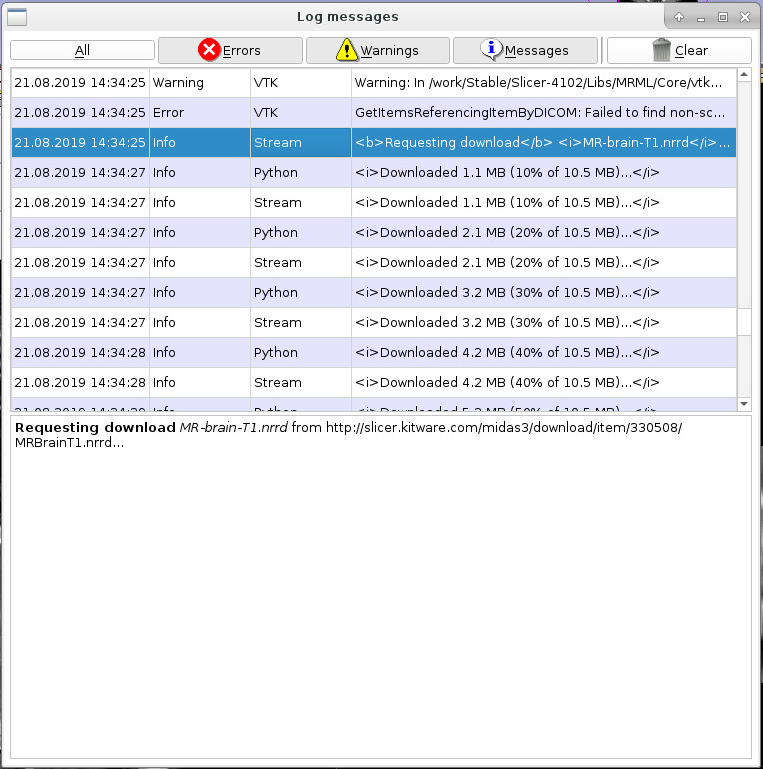
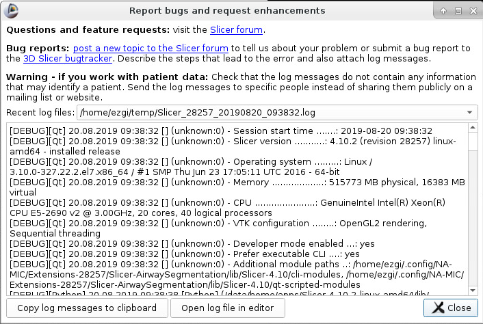

# Lab 02 Slicer #1: UI, overview of functionality, extensions, finding help 

Welcome to Slicer Lab #1! :tada::tada::tada:

Slicer is an open source software platform with a worldwide developwe community. It is being developed right now.
https://www.slicer.org/

## Preview vs stable versions
You can download Slicer from [here](https://download.slicer.org/) - Hope you already did :)

Stable version: rigorously tested
Preview version: changes (~nightly) as developers make [changes](https://github.com/Slicer/Slicer/graphs/commit-activity)

## General Application Window and UI
Related [wiki](https://www.slicer.org/wiki/Documentation/4.10/SlicerApplication/MainApplicationGUI).

* Load & Save (with a special DICOM buttom - stay tuned for Slicer Lab #2) buttons are shortcuts for loading and saving data.
* It is all about *modules*. When you first run Slicer, "Welcome to Slicer" module is loaded.
* Module Selection and Navigation 
   * the current module 
   * dropdown list of all available modules
   * a search functionality
   * module usage history
   * navigation through module usage history

  :pencil: Either use search functionality (click on the magnifying glass and start typing) or the drowdown list (Informatics > Sample Data) and find the Sample Data module. Load CT-MRBrain. This will download and load a CT volume and 2 MR volumes.
 
 
   
   You should see the image in slice views.
  
  
  
* Core Modules
* Layout options: Depending on your job, different Layouts for the visualization are useful. 
   
   
* Mouse mode (Landmarking / Fiducial Annotation)
* Screen Capture
* Crosshair visibility

* Extension Manager and Phyton Interactor: Beyond the Slicer you downloaded ... Coming up soon.

## Views: Slice and 3D
   
   * 3D Slicer is all about slices and 3D renderings/models (more about them soon). Conventional layout gives you 3 slice views and a 3D rendering (reconstruction) view.
   * Slices: red (axial: inferior to superior), yellow (sagittal: left to right) and green (coronal: posterior to anterior) slices. Usually data is acquired in one slice (most commonly axial) and the other slices are *reconstructed*. Slice views give you the capability to move through slices using a slider (or the wheel of your mouse). It tells you which slicer you are seeing in the *physical space* (mm).
   
   
   
   * Little *push-pin* on the top-left corner hides a panel of additional functionality. If you hover over it, it shows the panel; if you click on it, it pins the panel so it stays open. 
   * If you *link* the slices, then changes you make in this panel affects all three slice views. The closed *eye* icon is a symbol for visibility. 
   * If you click on the eye and open the eye, the slice will be visible in 3D view. If you already linked the slice views, all 3 will be visible in 3D. Go ahead and play with it. Change the slice (using the slider or the mouse wheel) and rotate the 3D view to experiment.
   
   
   
   * There is a double arrow button on the top left corner of this panel, you can open even more options and expand this panel. You can add a foreground volume (like a label-map or another volume you loaded) and change the transparency. 
   
   :pencil: Select another volume as your background (MRBrainT1 or CTBrain) and play with the transparency.
   
## Data Module

* Data module, the first shortcut in the Core Modules tab, shows the data in the scene. Subject Hierarchy view, the first tab, shows the data in a structured way as a tree. The more you use Slicer and the more data you produce, it comes handy to keep this clean.

:pencil: Let's create a new subject. 
  * Right click on the empty space in the Data Module, and select New Subject.
  * Double click on the name of the subject (or right click and select rename) and give it a name, like Subject_1. You can also rename the Volumes if you'd like.
  * You can drag and drop images in the scene under it if they belong to the same subject. 
  
* The eye icon next to the volumes indicate which one is visualized in the slice views. Try changing the volume in the slices by clicking on the (closed) eye icon of another volume. 
* You can delete data by right clicking and selecting Delete.

## 3D Rendering

* ROI

## Extension Manager
Related [wiki](https://www.slicer.org/wiki/Documentation/4.10/SlicerApplication/ExtensionsManager).

Extensions are packages of modules designed for specific purposes by developers and researchers. They work by adding modules to your Slicer. Good extensions provide examples and tutorials for you to follow in their wiki pages. 

* Click on Extension Manager (a puzzle piece with an E attached to it).

* Under Install Extensions tab, you will see extensions available to specific Slicer version you are using. Manage Extensions tab will show the extensions you already have, and Restore Extensions tab will show the extensions you previously installed in another version but can be restored to the current version. 

:pencil: Let's install SkullStripper extension (under Segmentation category).

  

  * We need to restart the Slicer. Let's go to Sample Data module and load **MRHead** data this time.
  * Find the SkullStripper module from the drop-down list (Segmentation > SkullStripper) or using the search functionality. 
  * This module takes an input volume and creates a brain surface mesh and a brain mask. 
  * Set the Input Volume to be MRHead, select "Create new Model" and "Create new LabelMapVolume" options for Output brain surface and Brain Mask. Set iterations to 100 and Subdivisions to 15. Click Apply. It should take about 2 minutes to finis.

  * You should see an approximate brain segmentation and a model in 3D. 
  
  
  
* Manually installing extensions?? 
  
## Preferences and Settings

Go to Edit > Application Settings. When you make changes in the settings, little asterisks will appear on the menu next to the section where you made the changes. When you clik OK, you need to restart Slicer to apply the changes.

* General settings include the default directory for saving, options for confirming restart/exit/scene close etc.

* Modules settings let you customize the modules list from the drop-down menu and the shortcuts in the Core Modules bar. To customize select Modules on the left pane. You will see the list of available modules and the *Core Modules* menu bar. Drag and drop any module you'd like.

:pencil: I use *Volume Rendering* frequently so it is in my Core Modules. Let's add it to the shortcuts. You can thank me later in the workshop. :grin: You can use the arrows to adjust the position of your new shortcut in the menu bar. I like Volume Rendering next to the Volumes module.
   

   
* Appearence settings are cosmetics like fonts etc.
* Views allows you to set the defaults for slice and 3D views. I like using orthographic projection, for example, so my Slicer defaults to that.

* Extension settings show the server where extension manager downloads the extensions from and where they are installed on your machine.
* Another important group of setting is the Volume rendering. You can adjust the mode (if you have a dedicated GPU, GPU Ray Casting is much more superior to CPU) and the amount of memory dedicated to rendering. 

## Log File and Reporting a Bug
Related [wiki](https://www.slicer.org/wiki/Documentation/Nightly/Report_a_problem)

* Slicer logs certain events, warnings and errors while you are working on your job. The little red sign on the bottom-right corner with an X in the middle opens the log. Each log entry has a date-and-time stamp; a label of Error, Warning or Info; and a label for the source of the log message (VTK, Pyton etc. are different libraries and bindings Slicer uses).  Clicking on a log entry shows a description below. You can also filter the messages by type using the buttons on the top. 

* Logs are kepts as text files on your system. A new session starts when you start Slicer and a new log file is created. If something unexpected happens and you think it is a *bug*, log files are useful when you are reporting it. It is also super useful if your problem is due to a configuration error (e.g. Slicer cannot find a directory on your system).

* You think you found a bug:
  * **Make a Google search** to see if the problem has been reported before.
  * To report a bug go Help > Report a bug. Copy the related log entries and provide it with the description of your problem. This window also gives you a link to the [Slicer Discorse](https://discourse.slicer.org) or [3D Slicer bugtracker](https://issues.slicer.org/) for reporting bugs.

## Helping Yourself
* Sample Data module
* [Keyboard shortcuts and mouse keys](https://www.slicer.org/wiki/Documentation/Nightly/SlicerApplication/MouseandKeyboardShortcuts)
* [Slicer FAQ](https://www.slicer.org/wiki/Documentation/Nightly/FAQ)
* [Slicer tutorials](https://www.slicer.org/wiki/Documentation/Nightly/Training)
* [Maga lab Specific tutorials](https://blogs.uw.edu/maga/)
* discourse forum for unanswered questions (an example of good question) 

* youtube channels (SlicerMorph and perklab)

   http://bit.ly/SM_youtube  
   https://www.youtube.com/user/PerkLabResearch  
