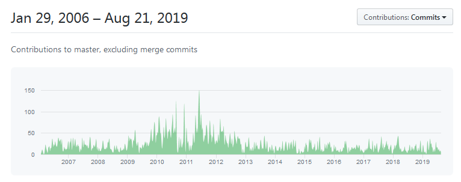

# Lab 02 Slicer #1: UI, overview of functionality, extensions, finding help 

Welcome to Slicer Lab #1! 

Slicer is an open source software platform with a worldwide developwe community. It is being developed right now.
https://www.slicer.org/

## Preview vs stable versions
You can download Slicer from [here](https://download.slicer.org/) - Hope you already did :)

Stable version: rigorously tested
Preview version: changes (~nightly) as developers make [changes](https://github.com/Slicer/Slicer/graphs/commit-activity)

## General Application Window and UI
Related [wiki](https://www.slicer.org/wiki/Documentation/4.10/SlicerApplication/MainApplicationGUI).

* Slicer 4 Application GUI overview

* Everything is a *module*.
* searching modules, module usage history, navigation through modules
* Layout options, slice controls, planes, 
* Log file, recovering and reporting a bug through log (help->Report a bug)
* Preferences, settings, temp/cache director, modules, customizing toolbar

* [Extension Manager](https://www.slicer.org/wiki/Documentation/Nightly/SlicerApplication/ExtensionsManager)
* manuall installing an extension (https://www.slicer.org/wiki/Documentation/Nightly/SlicerApplication/ExtensionsManager#How_to_manually_download_an_extension_package.3F) 
* creating/managing Region of Interest (ROI)
* [Keyboard shortcuts and mouse keys](https://www.slicer.org/wiki/Documentation/Nightly/SlicerApplication/MouseandKeyboardShortcuts)
* data module functionality (slice view controls, 3D rendering etc, rename etc)

## Helping Yourself
* Sample Data module
* [Slicer FAQ](https://www.slicer.org/wiki/Documentation/Nightly/FAQ)
* [Slicer tutorials](https://www.slicer.org/wiki/Documentation/Nightly/Training)
* [Maga lab Specific tutorials](https://blogs.uw.edu/maga/)
* discourse forum for unanswered questions (an example of good question) 

* youtube channels (SlicerMorph and perklab)

   http://bit.ly/SM_youtube  
   https://www.youtube.com/user/PerkLabResearch  

---
## Slicer Viewer Controller blowup

