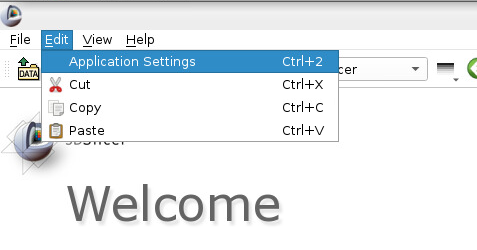
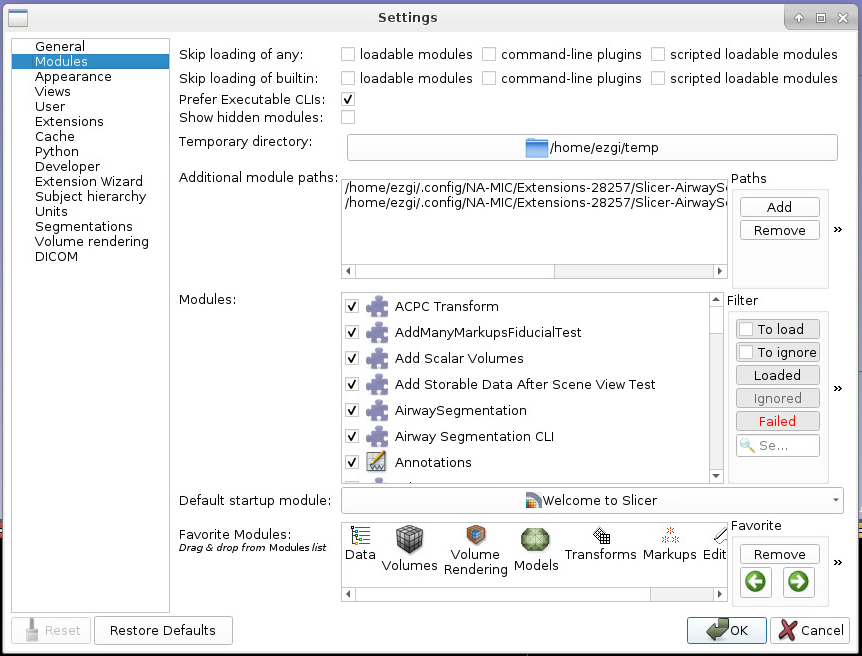

# Lab 02 Slicer #1: UI, overview of functionality, extensions, finding help 

Welcome to Slicer Lab #1! 

Slicer is an open source software platform with a worldwide developwe community. It is being developed right now.
https://www.slicer.org/

## Preview vs stable versions
You can download Slicer from [here](https://download.slicer.org/) - Hope you already did :)

Stable version: rigorously tested
Preview version: changes (~nightly) as developers make [changes](https://github.com/Slicer/Slicer/graphs/commit-activity)

## General Application Window and UI
Related [wiki](https://www.slicer.org/wiki/Documentation/4.10/SlicerApplication/MainApplicationGUI).

* Slicer 4 Application GUI overview

* Load & Save (with a special DICOM buttom - stay tuned for Slicer Lab #2) buttons are shortcuts for loading and saving data.
* It is all about *modules*. When you first run Slicer, "Welcome to Slicer" module is loaded.
* Module Selection and Navigation 
   * the current module 
   * dropdown list of all available modules
   * a search functionality
   * module usage history
   * navigation through module usage history

   Either use search functionality (click on the magnifying glass and start typing) or the drowdown list (Informatics > Sample Data) and find the Sample Data module. Load CT-MRBrain. This will download and load a CT volume and 2 MR volumes.
   
   
   You should see the image in slice views.
   
  
* Core Modules
   * You can customize this list: Go to Edit > Application Settings. 
   
   
   * Then select Modules on the left pane. You will see the list of available modules and the *Core Modules* menu bar. Drag and drop any module you'd like, I like *Volume Rendering* as a core module. You can use the arrows to adjust the position of your new shortcut in the menu bar. 
   
   
* Layout options: Depending on your job, different Layouts for the visualization are useful. 
   
   
   * 3D Slicer is all about slices and 3D renderings/models (more about them soon). Conventional layout gives you 3 slice and 1 3D rendering (reconstruction) views.
   * Slices: red (axial: inferior to superior), yellow (sagittal: left to right) and green (coronal: posterior to anterior) slices. Usually data is acquired in one slice (most commonly axial) and the other slices are *reconstructed*. Slice views give you the capability to move through slices using a slider (or the wheel of your mouse). It tells you which slicer you are seeing in the *physical space* (mm).
   
   
   
   * Little *push-pin* on the top-left corner hides a panel of additional functionality. If you hover over it, it shows the panel; if you click on it, it pins the panel so it stays open. 
   * If you *link* the slices, then changes you make in this panel affects all three slice views. The closed *eye* icon is a symbol for visibility. 
   * If you click on the eye and open the eye, the slice will be visible in 3D view. If you already linked the slice views, all 3 will be visible in 3D. Go ahead and play with it. Change the slice (using the slider or the mouse wheel) and rotate the 3D view to experiment.
   * There is a double arrow button on the top left corner of this panel, you can open even more options and expand this panel. You can add a foreground volume (like a label-map or another volume you loaded) and change the transparency. 
   
* Log file, recovering and reporting a bug through log (help->Report a bug)
* Preferences, settings, temp/cache director, modules, customizing toolbar

* [Extension Manager](https://www.slicer.org/wiki/Documentation/Nightly/SlicerApplication/ExtensionsManager)
* manuall installing an extension (https://www.slicer.org/wiki/Documentation/Nightly/SlicerApplication/ExtensionsManager#How_to_manually_download_an_extension_package.3F) 
* creating/managing Region of Interest (ROI)
* [Keyboard shortcuts and mouse keys](https://www.slicer.org/wiki/Documentation/Nightly/SlicerApplication/MouseandKeyboardShortcuts)
* data module functionality (slice view controls, 3D rendering etc, rename etc)

## Helping Yourself
* Sample Data module
* [Slicer FAQ](https://www.slicer.org/wiki/Documentation/Nightly/FAQ)
* [Slicer tutorials](https://www.slicer.org/wiki/Documentation/Nightly/Training)
* [Maga lab Specific tutorials](https://blogs.uw.edu/maga/)
* discourse forum for unanswered questions (an example of good question) 

* youtube channels (SlicerMorph and perklab)

   http://bit.ly/SM_youtube  
   https://www.youtube.com/user/PerkLabResearch  
