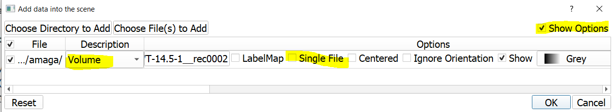
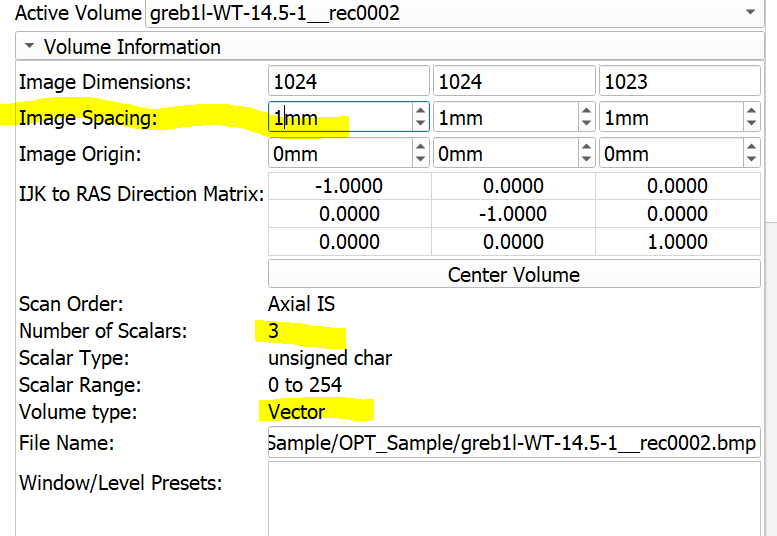
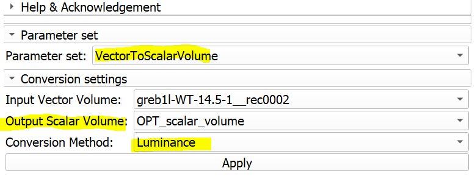
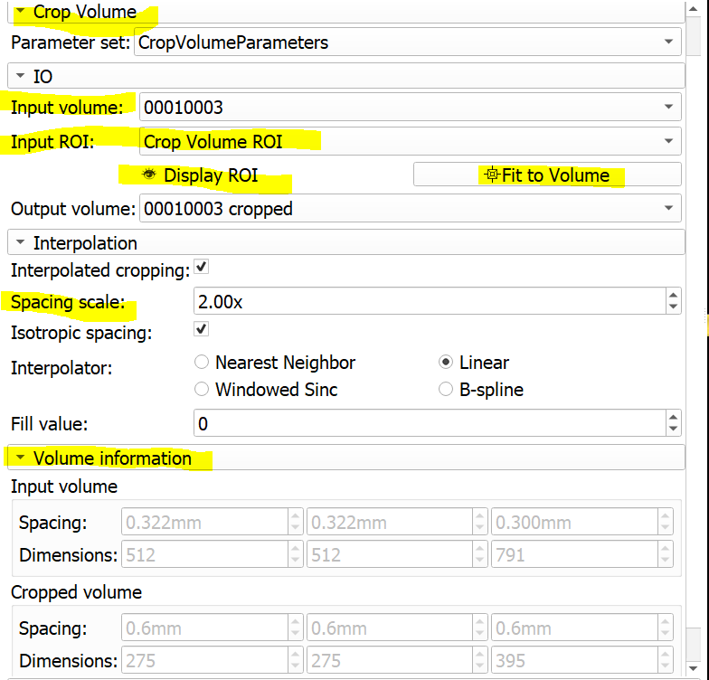

# Lab 03 Slicer#2: Data formats, getting data from MorphoSource, saving
* **image stacks vs volume files** We prefer to import the image sequences and save them as 3D volume to the convenience of working with single files. More importantly, except for DICOM format, most 2D image format are not well-suited to preserve the geometry and resolution information of volumetric scans. In this lab we will review how to import a non-DICOM stack, check and correct its voxel spacing, and then make sure that it is correctly converted to a scalar volume (as oppose to multichannel, vector volumes). 

Two well-documented, and commonly supported image volume formats are:
* [Nearly Raw Raster Data: NRRD](http://teem.sourceforge.net/nrrd/format.html)
* [Neuroimaging Informatics Technology Initiative: Nifti](https://nifti.nimh.nih.gov/)

* [List of image formats supported by Slicer](https://www.slicer.org/wiki/Documentation/Nightly/SlicerApplication/SupportedDataFormat)
* [pixel coordinates vs physical coordinates](https://www.slicer.org/wiki/Coordinate_systems)

## Image Import Examples
* **Import non-DICOM image sequences**
  * Examples from local data
    * Drag and drop one of the bmp files into the Slicer scene from the OPT sample data (Lab03_Exercise\stack_import_examples\Skyscan_OPT_Sample\OPT_Sample)
    * Enable `options` in the Load Data Into Scene dialog box
    * Choose `Volume` from Description
    * Uncheck `Single File`
    * Hit `OK`
<<<<<<< HEAD
    
    
    
    * You should have the sequence loaded into your Scene
    
    ### Go to `Volumes` module and correct the image spacing should be 0.0118mm (we know this from the scanner log file). 
    
    
    
    
    ### Go to `VectorToScalar` module and convert the vector image to a scalar volume using the luminance method
    
    
    
    ### The previous step will generate a new scalar volume (review your `Data` module contents), which is the file you would like to preserve for your downstream work. 
=======
    * You should have the sequence loaded into your Scene
    * Go to `Volumes` module and correct the image spacing should be 0.0118mm (we know this from the scanner log file). 
    * Go to `VectorToScalar` module and convert the vector image to a scalar volume using the luminance method
    * The previous step will generate a new scalar volume (review your `Data` module contents), which is the file you would like to preserve for your downstream work. 
>>>>>>> 2bf6373afb5afea31908a0c191b023a8b7b8f3eb
    * You are ready to save your data.
    
    

[You can find detailed explanation of `Save` dialog box](https://www.slicer.org/wiki/Documentation/Nightly/SlicerApplication/SavingData)

    
* **Import DICOM image sequences**
  * Drag and Drop one of the DICOM files into Slicer (Lab03_Exercise\DICOM_samples\Smithsonian_Chimp_Skull\USNM599167_CRANIUM)
  * Note that from DICOM, `single file` option already unchecked and Description is set to `Volume` by default (if not, fix them)
  * Hit `OK`
  * Go to `Volumes` module and check the Volume information (image dimensions, spacing volume type and volume type)
<<<<<<< HEAD
   * You are ready to save your data.

  
  * If you have large number DICOM sequences to import, you may consider using:
  * [DicomBrowser Module](https://www.slicer.org/wiki/Documentation/Nightly/Modules/DICOM) or an external command-line tool like 
  * [DCM2NIIX](https://github.com/rordenlab/dcm2niix/releases) is a commandline tool for convert DICOMs or

## Downsamping Volumes via ResampleScalarVolume

* Load the file you saved in previous section (For me it is called *00010003.nrrd*) 
* Review the image spacing values for the original volume (HINT: Under `volumes` module, and for me they are 0.322x0.322x0.3mm)
* Search for `ResampleScalarVolume` module
* Set the input and output volume options and set your spacing option to something larger than your original volume (I used 0.5x0.5x0.5mm)
* Hit `Apply`

**You should now have a low-resolution version of your original volume.**

## Downsamping Volumes via CropVolume

* Load the file you saved in previous section (For me it is called *00010003.nrrd*) 
* Review the image spacing values for the original volume (HINT: Under `volumes` module, and for me they are 0.322x0.322x0.3mm)
* Search for `CropVolume` module
* Create ROI, hit the `Fit Volume` button
* Set the input and output volume options and set your spacing option to something larger than 1.0, if you want to reduce your dataset (I used 2)
* If you expand the `Volume Information` tab you should be able to set what the input volume dimensions were and what they would be in the cropped volume.
* Hit `Apply`

=======
  * If you have large number DICOM sequences to import, you may consider using:
  * [DicomBrowser Module](https://www.slicer.org/wiki/Documentation/Nightly/Modules/DICOM) or an external command-line tool like 
  * [DCM2NIIX](https://github.com/rordenlab/dcm2niix/releases) is a commandline tool for convert DICOMs or
 
>>>>>>> 2bf6373afb5afea31908a0c191b023a8b7b8f3eb
## Work on your own:
1. Repeat the CropVolume exercise with modifying the ROI (i.e., only crop a portion of the volume)
2. **Obtain sample data from MorphoSource.** 
  * Go to https://www.morphosource.org/Detail/MediaDetail/Show/media_id/2095
  * Add the calcaneus **M2095-1895** to your cart (you should have an account on MorphoSource)
  * Agree to the terms and download. You should get a file called *Morphosource_amnh_mammals_m-188156_M2095-1895.zip*
  * Drag and drop that file to Slicer and answer the question about zip file contents as YES
  * In the Data dialog box, uncheck the ...USerAgreement.pdf (shows as a scalar overlay), and keep the other two checked
  * Hit OK
  * Switch to `3D Table` view in the layout options
  * Enable the MorphoSource data table from Data Module
