# Lab 05 Slicer#4: Segmentation, mesh conversion, 3D printing 

Welcome to Slicer Lab #4: Segmentation :scissors: :art: :gem:

## Segmentation

Segmentation is one of the most useful things you can do with Slicer! It could be automated / semi-automated or fully manual! Most of the time, you will need a semi-automated approach. 

A segmentation is an abstract representation of stuctures in an image. It usually contains more than one segment (usually non-overlapping) annotated with different colors in 2D and 3D. In Slicer, Segmentations and Segment Editor modules will be our friends during this lab. 

### Segmentation vs. LabelMap vs. Model
A segmentation is a group of segments. It needs a "Master Volume" to work on. You can create segmentation based on the intensities of voxels (or pixels) and their temporal/spatial properties (nearby voxels/pixels with similar intensities belong to the same segment). 

A *label map* is an *image* where the value of each voxel/pixel is the label of the segment that voxel/pixel belongs to. A label map for an image is the same size/dimensions (and even physical space if the format of the image allows it) as the image and assigns exactly one label to all voxels/pixels. Usually 0 is the background. A segmentation does not have these constraints, segments can overlap, do not need to cover all pixels/volxels and can be represented in different ways (it doesn't need to be an image). Label maps are very useful for storing segmentations (they are the same size as images and usually have very few pixel values, a 5-segment segmentation needs only 6 integers to encode and can be compressed efficiently). Label maps are also useful for some analysis methods. 

A *model* is a *surface mesh* with points and polygons (usually triangles) and a very useful representation for segments. Usually, the outer surface of a 3D segment is represented with a closed surface mesh. Models are good for visualization and some analysis methods. However, they can be quite large and cumbersome to read and write. (Side note: existing mesh formats are inefficient for I/O and they don't have "units" and "physical space" which are critical for medical applications. One needs to be very careful playing with meshes converted from volumes.)

In Slicer, you will first create a Segmentation - which can be converted to LabelMap or a Model depending on your analysis.

## Segment Editor 

:pencil2: Load MRBrainTumor1 data from SampleData module. Let's segment that tumor. 

* Find Segment Editor module from the list, through search function or from the Core Modules shortcuts. 

* Name your segmentation (if you'd like - it is nice to keep track of things if you are working with a lot of data in one session) and select your master volume, MRBrainTumor1 in this case. 

* Add a segment by clicking +Add button. It will be named "Segment_1" if it is the first one you created and the numbers will keep increasing as you add more segments. Let's segment the tumor in Segment_1 so rename the segment properly (as Tumor for example). You can rename the segment by double-clicking on its name. 
You can also change the color of the segment by double clicking on the color next to its name, it is nice to have contrasting colors for the segments so that your visualization is easy to look at. The colors do not mean anything other than visualization. Side Note: If you save your segmentation as a LabelMap, the order of the segments will matter (they will have the labels 1,2,3..n based on the order) and if you don't save your color map separately for Slicer, they might be colored differently next time you load your LabelMap.

Slicer have quite a few color maps you can pick and choose from.

As soon as you add the segment, the tools in the Segment Editor are enabled. Click on the first one, "Paint".

* Each Effect (or tool) is useful in a different scenario (some more than others) and you will have favorites soon. But first things first: 
  * Slicer gives you parameters and options for each tool. Use them. 
  * Undo/Redo buttons allow you to take back some steps but they are limited (I guess 8?).
  * Masking area is important. Right now you have one segment but you will have more than one and if you are not careful, you can erase or cut or overwrite other segments. Set these options carefully EACH TIME before you apply an effect /tool. I like to keep the "Overwrite other segments" option in "Visible segments" and make all other segments invisible if I am not working with them. This is one mistake that's hard to recover from... :sob:
    * None: none of the other segments are overwritten so blue segment is overlapping with the green one.
    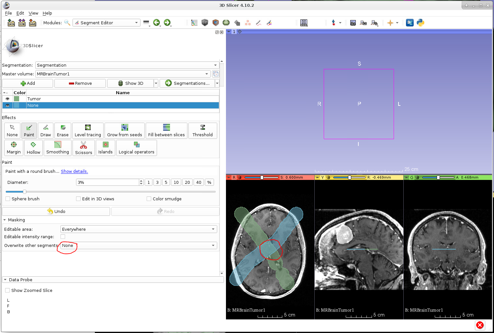
    * All segments: The new segment can overwrite the others if it overlaps with them.
    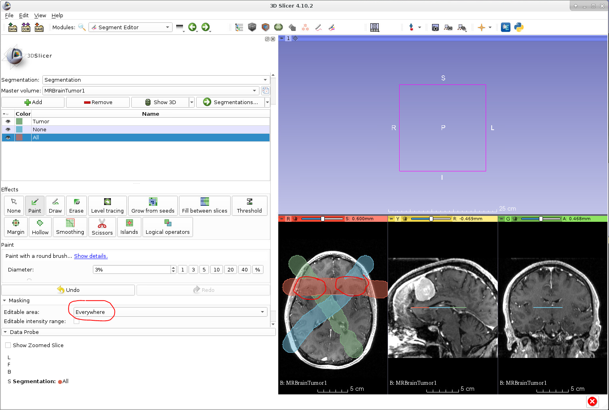
    * Visible segments: I made the green segment invsible, painted with the light reddish one, and it overwrote the blue. But when I turned the visibility of the green segment back on, it was overlapping with the new segment and was not overwritten. Expected effect. 
    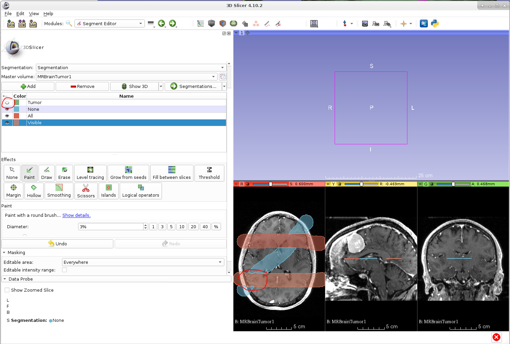
    
    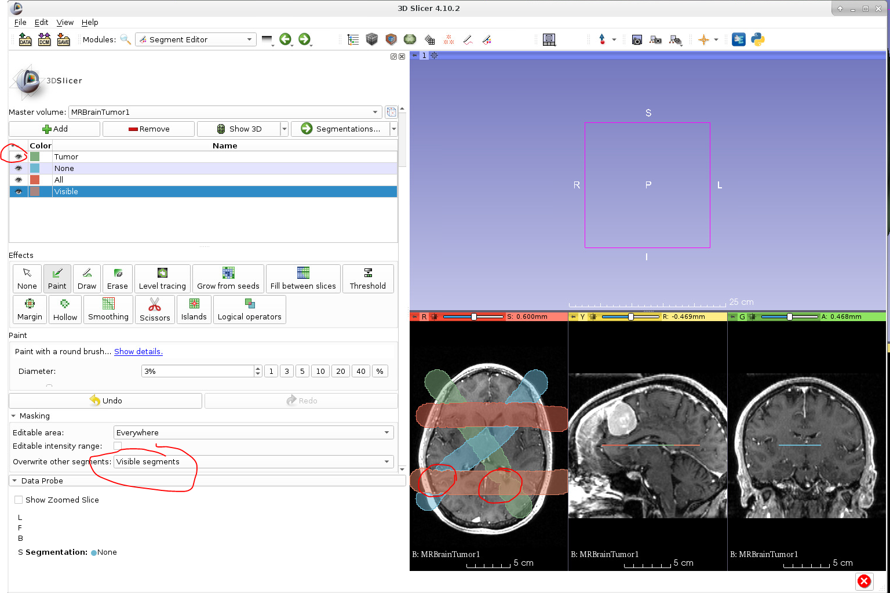 
  
:pencil2: Explore some of the Effects (tools). 
  
* **Paint/Erase** is very useful as starting point of some semi-automated methods. It is literally painting over pixels (or voxels). Important thing is to adjust the diameter and select between sphere and circle brush. 
   * Try using it without changing anything: simply paint over a slice in any of the red/yellow/green slice views. Then, move between slices (mouse wheel on any of the red/yellow/green views or slider at the top of them). Then, change it to a sphere brush and try again. When it is a sphere brush, you are painting/erasing in 3D. Note the spherical or disk-shaped brush in 3D view when you are painting in slice view. 
   
   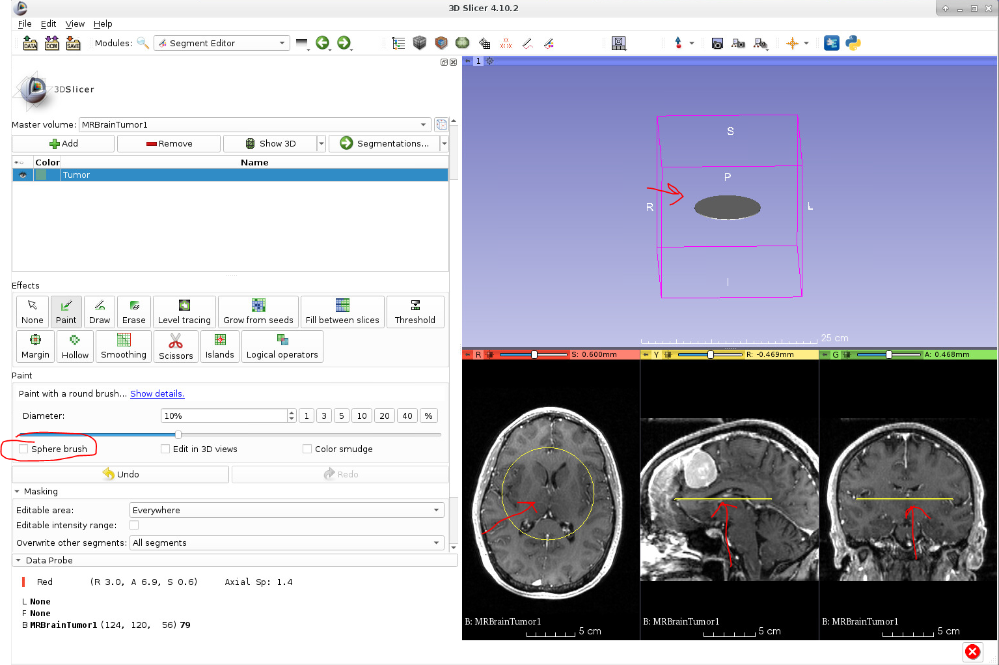
   
   
   
   * Click on the Show 3D button at the top. This creates a surface model visualization of your segmentation. It may take a few seconds. Mostly it is the smoothing operation that takes a bit long. If you turn of the smoothing by clicking the little arrow next to the Show3D button, you will notice the rendering will "pixelate". 
     * Although it is possible to paint/erase in 3D, it is extremely clunky (for technical reasons). 3D rendering needs to be updated as you edit it, and it is computationally expensive to do so. So, I recommend using it sparingly to check your segmentation or for limited operations (like Scissors tool we'll play with in a minute).
     
    
    
    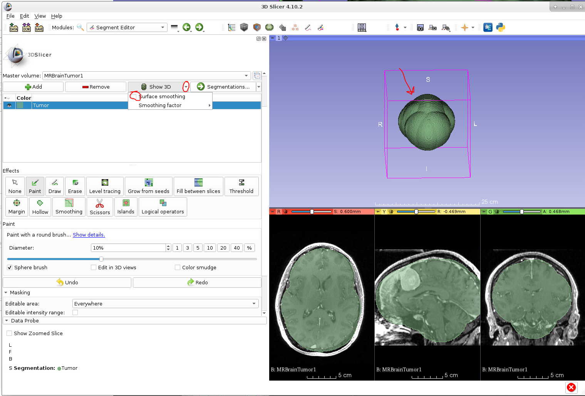

* **Threshold** is one of my favorite tools to begin any segmentation. It creates segments based on an intensity range. In most modalities, the intensities of certain anatomical structures are known. It is also interactive, so you can play with the range until you found a working set.
 
 :pencil2: Click on Threshold and find a good range that works for the tumor in the image. Note how segmentation overlay on slices flashes while you change the range. It doesn't need to be perfect. Make sure "Show 3D" is turned off to speed things up. 

* **Islands** is the next stop in most of my segmentation pipelines. Sometimes there are more than one structure in the same intensity range, if they are not "conenected", it is easy to separate them. An island (connected component) is a group of pixels/voxels with the same label and that are "connected". Let's explore the options:
  * Keep largest island: removes all islands except the largest (defined as number of pixels/voxels) connected component. 
  * Remove small islands: removes smaller islands (smaller than the "minimum size") and still ends up with one segment that can be multiple islands.
  * Split islands to segments: creates a new segment for each island that is larger than the "minimum size". This is useful if you have multiple islands you are interested in and want to decide on island-by-island. This creates new segments.
  * Keep selected island: let's you click on the image / on the segment. Keeps the island that includes the pixel you clicked, and removes rest of the islands from the segment. This is also nice if you think the structure you are interested is actually one island, not splitted. 
  * Remove selected island: opposite of keep selected island.
  * Add selected island: ???
  
  :pencil2: In my case, I kinda know that tumor is seperated from the skull and currently my segment contains both the skull, some nasal airways and the tumor. I am going to use "Keep selected island" and click on the tumor. Then I can visualize by clicking Show 3D and decide if I want to "Undo" or not. 
  
  
  
  So I am happy with the segmentation, I can clean up the vascular structure attached to the tumor and make it work. Try your own methods and experiment!
  
  * **Scissors** is the next stop on our tour. Now I want to clean the extra voxels from my segment, but I don't want to do that using eraser slice-by-slice and I am not good with spherical eraser which can remove stuff I don't see in other slices. So scissors give us more flexibility on what to remove. The idea is to select a region in any size and different forms and remove it. It has different options: 
   * Operation: You can select the region to remove or keep or even fill. 
   * Shape: You can select a free-form region, a circular region or a rectangular region.
   * Slice cut: You can remove/keep/fill regions in an unlimited "depth", in positive direction or negative direction. This needs a bit of explanation. The structures we play with are in 3D space but our screens show us a 2D image. In slice views, the axes are pre-determined: in the red slice ciew the unseen 3rd dimension is supero-inferior axis, in the yellow it is right-left, in the yellow it is antero-posterior. In 3D view, the 3rd unseen dimension (imagine the direction from the screen towards your face and towards behind the screen) is whatever orientation your rendering is. So when you select "Unlimited" in slice cut option, it creates a region in unlimited size in this 3rd dimension. If you are cutting in 3D view, it will remove/keep everything inside the region you draw, in front of it, and behind it. Positive and negative options divide this space into 2 in slice views, positive being the superior, right and anterior directions. Symmetric removes or keeps a region with the size you give (in physical coordinates not slices) around the slice you are operating on. It is easier to see the effect when you try:
   
   Some examples below:
   
   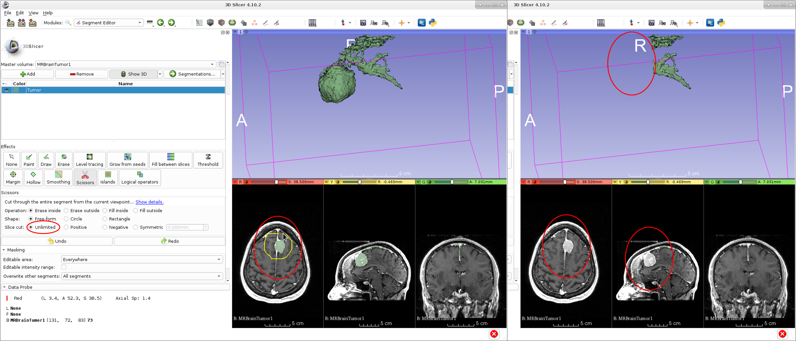
   
   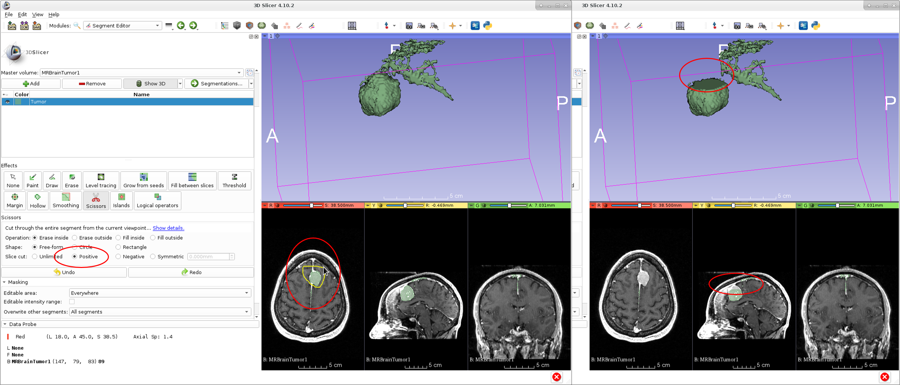
   
   
   
   
   
   
   :pencil2: I am going to use Scissors in 3D view to remove extra vessels around the tumor. I am going to rotate the rendering and use unlimited free-form remove option. Don't forget to switch to "None" Effect or tool before rotating the rendering. 
   
   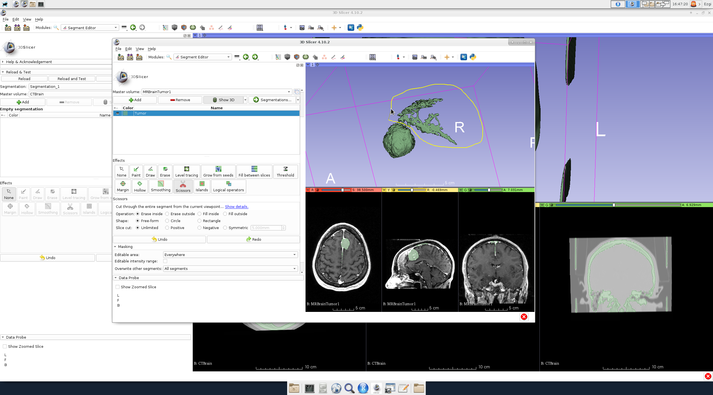
   
 * **Margin** tool lets you grow or shrink your segment with given margin size (in physical space not in slices). Remember your images may not have isotropic dimensions (in most clinical CTs axial slices tend to be thicker, 0.6mm or 1.25mm or 2.5mm, compared with sagittal and coronal slices,  0.35mm) so it can only go as small as the voxel size of your image.

 * **Logical operations** on segments lets you Copy one segment to a new one, add one segment to another (useful if Islands split your segment into two), subtract one segment from another, take the intersection of two segments, invert a segment, fill (the segment will contain the whole image) or clear (the segment will be empty) a segment. 
 
 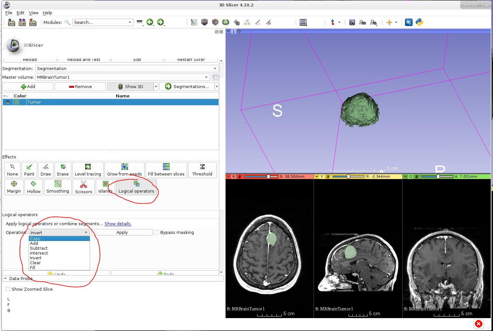
 
 As before, it is important to set Masking options correctly to achieve desired results.
 
 
 
 * **Hollow** tool lets you create a *hollow* segment with the thickness specified in the options and using the segment boundary as inside/outside or median border of the new segment.
 
 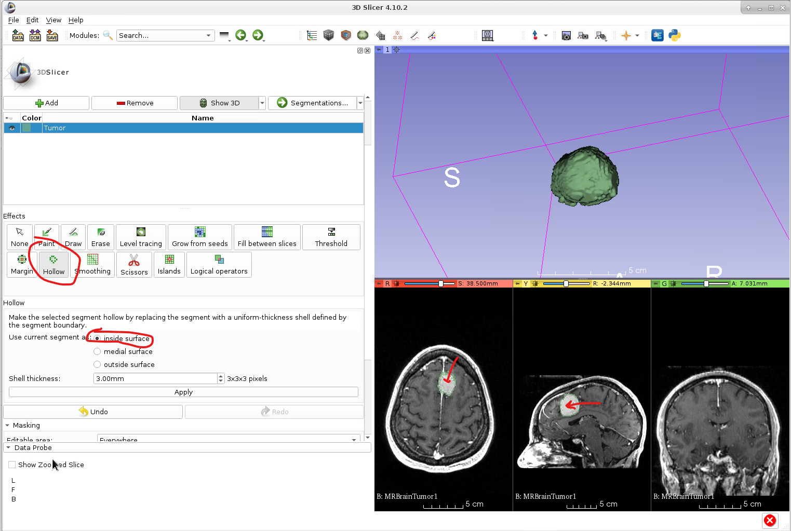
 
 * **Smoothing** tool applies binary smoothing to the segment and smooths the borders. There are different options (and a few binary operations actually) here. Click on "Show more" to read about them.
 
 
 
 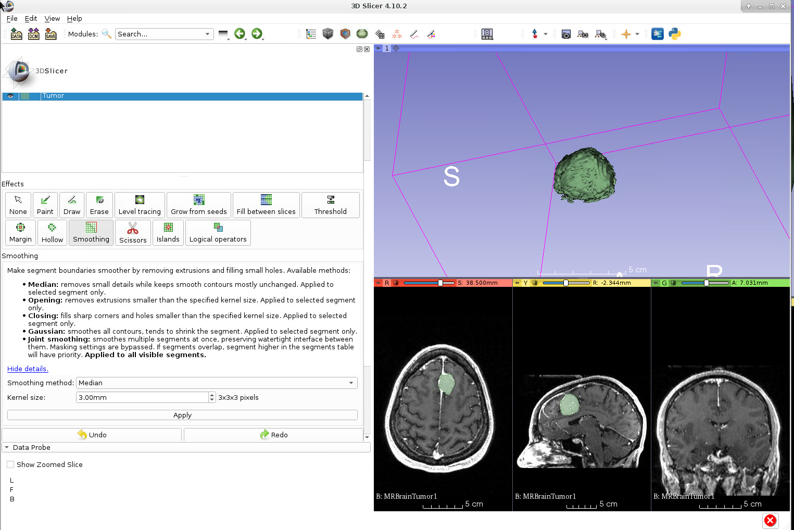
 
  * Most commonly used smoothing filters are Gaussian and Median filters (that actually apply filters or convolutions you saw in the Lecture 2: Applied Imaging Concepts). 
 
   * Closing and Opening have interesting effects like removing parts of sticking out of your segment and filling holes. The size of parts to be removed and holes to be filled depends on the kernel size option of your tool. See below some examples:
   
   
   
   
   
### Segment Editor Extra Effects extension (flood fill, mask/split volume, etc)

## Segment Statistics

Now that you segmented your structure of interest, you may want to calculate some statistics. Don't worry, there is a module for that!

:pencil2: Find an open Segment Statistics module.
Make sure your Segmentation and your Volume are selected. You can leave the output as New Table. Open options by clicking the buttons and see what statistics will be calculated. When ready, hit Apply.

Notice that the layout is automatically changed and a new "Table View" is added. This view displays the results of Segment Statistics module in a table format. Since I have only one segment, it calculated stats for only that. 

See below a real life example where we calcualted the orbital volumes for a trauma patient:

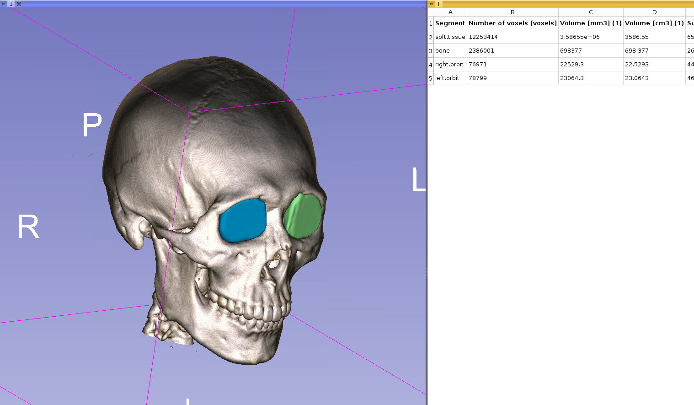

## Segment Registration

## Segmentations module 

Segmentations module goes hand-in-hand with the Segment Editor module. You can even easily switch to it by clicking on "Segmentations" button on top of the Segment Editor module. 

First panel lists all segments in your segmentation and lets you change the visibility, opacity and color of the segments.

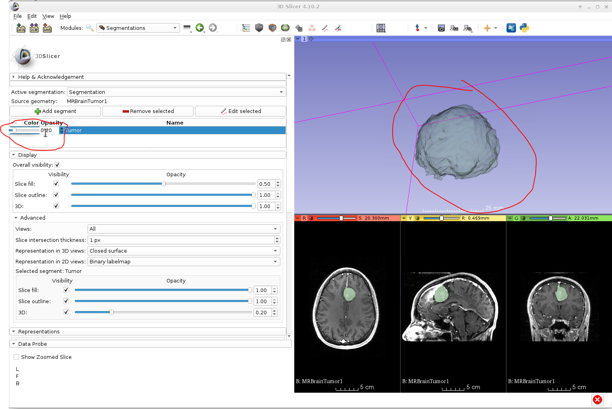

The next panel, Display, controls the display properties. By default, the segments are visualized with opac borders and transparent fills on slices. You can change the opacity and visibility of these here for ALL segments at once. The next panel lets you control these settings for the selected segment only.

You can turn off the visibility of a segment in a specific view, see below:

The Copy/Move panel allows you to copy or move the segments in your segmentation to a new segmentation. 

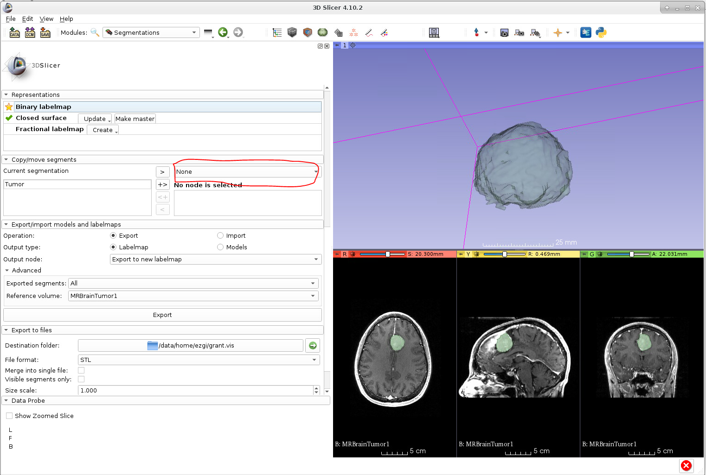

This part is important. Exporting your segmentation. Most analyses require a LabelMap or a Model as we discussed. You can export any segments or all segments as LabelMaps or Models here. If you are exporting a LabelMap, it may be important to select your reference volume since the new LabelMap is actually a volume/image that needs a physical space (Origin, Spacing, Dimensions etc.). If you do not select a reference volume, the segmentation will be exported to smallest possible volume/image and you may not be able to easily use it as a mask with your original image. 

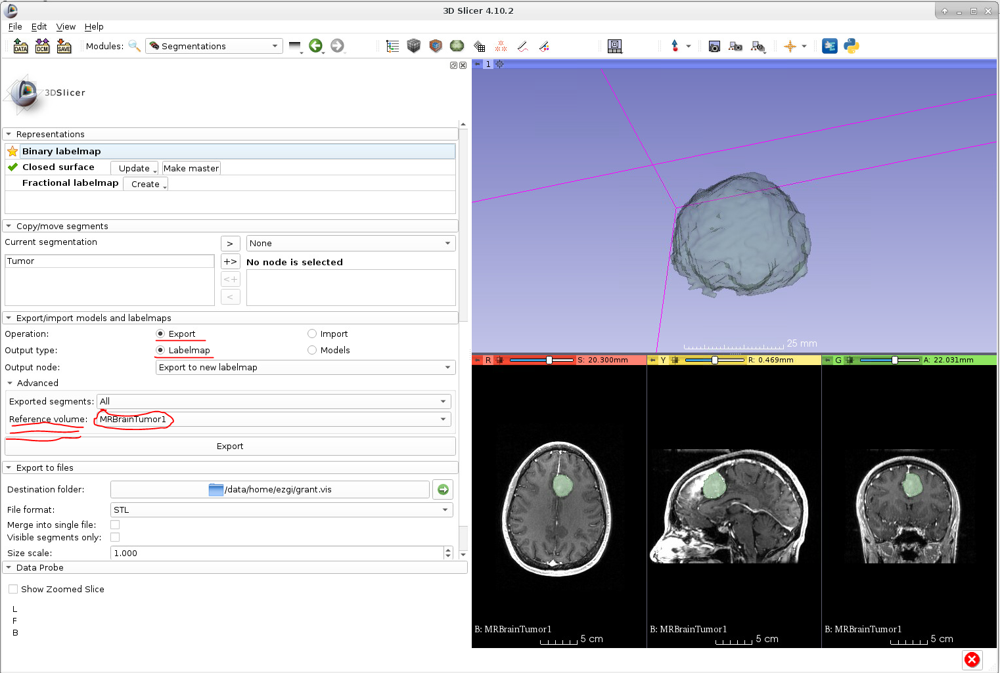

Another fair warning: if your segments are overlapping, the new LabelMap produced will give priority to the "later" segments in the order, i.e. the segment that's down the list will claim the overlapping voxels. See below:

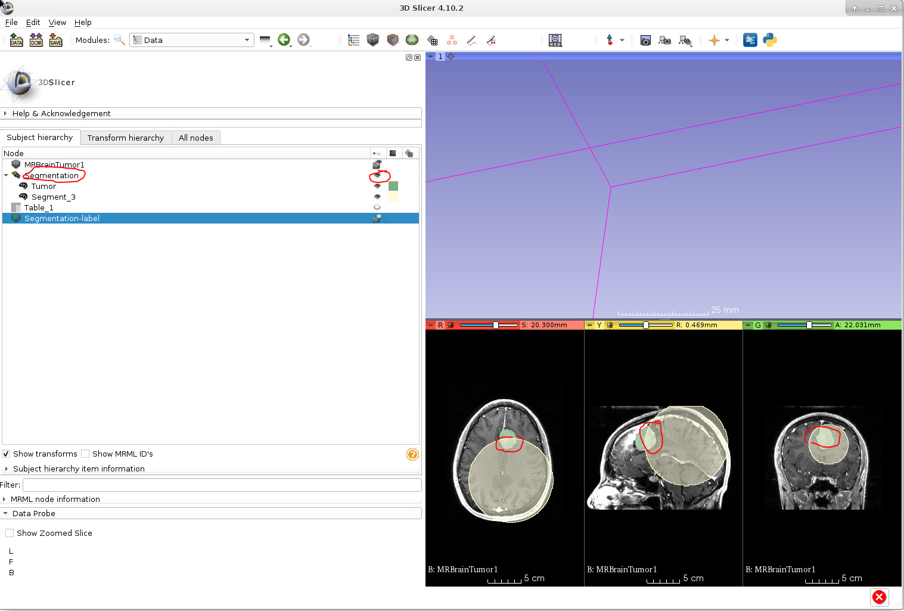

:pencil2: Let's export our segmentation as a LabelMap. Now our LabelMap is a speacial volume in the scene, check it out in Data module. You can save it as an image file (NIFTI or NRRD recommended). 

Let's go and check volume properties in Volumes module. Our image and LabelMap should have same dimensions and spacing, same physical space, but the actual values of voxels for the LabelMap should be 0 and 1. 

## Mask A Volume

One of the most useful things you can do with Segmentation and LabelMaps is to mask raw images to remove unneccesary objects or clean up. 

:pencil2: Find and open Mask Scalar Volume module. 

* Select your image as the input (MRBrainTumor_1), your LabelMap as the mask (Segmentation-label) and Create New Volume option as the output. The "label value" indicates which label from your LabelMap will be the foreground (since mine has only 1 label right now, I'm going to use 1). The "replace value" indicates the voxel value that will be assigned to all voxels except those with label value in the LabelMap. In my example, it will be all voxels outside the tumor segment. 

* Hit Apply. Slicer should show the new volume created in the slice views. It should be an image with the tumor region same as the original one, and the rest should be 0. It is easier to see if you turn off the visibility of the segmentation from Data module and find the slices that contain the tumor using sliders or your mouse wheel.

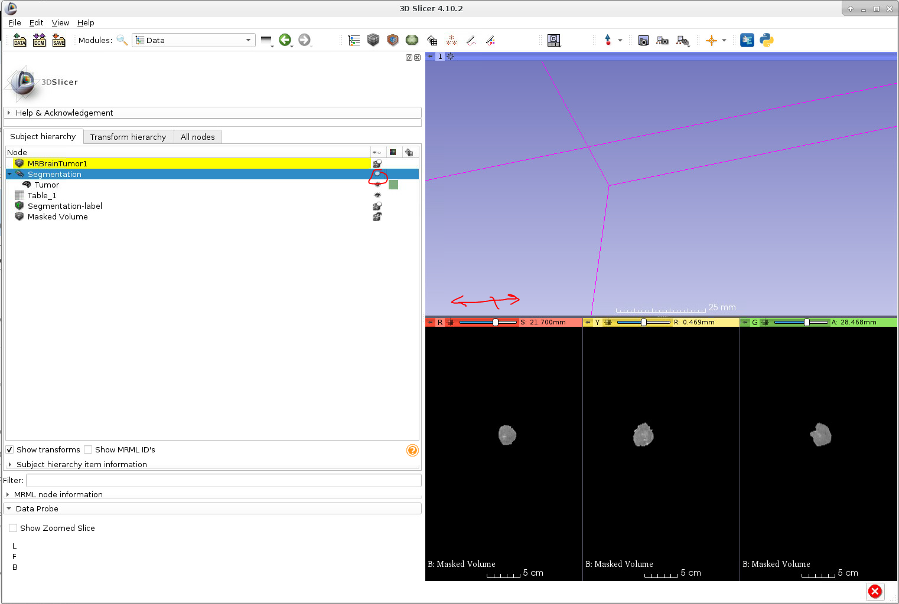

Side note: Most of the time, the "replace value" in Mask Scalar Volume is set to 0 since 0 means background in most modalities. However, 0 intensity may mean other tissue in your modality. For example, in CT images, I use -1000 as replace value since that correspond to air in hounsield units while 0 is in soft tissue. Pick your replace value wisely. 

# Models

A model is another representation you can produce from your segmentation. 

:pencil2: Go back to Segmentations module (I am lazy so I first go to Segment Editor using shortcuts, then I click on Segmentations) and export a Model of your segment. You can leave the output nose as it is and it will create a new model hierarchy. If your segment is relatively small, it should take a short time. 

This representation is not a volume anymore, it looks like the thing you saw when you hit Show 3D button in Segment Editor but this is not just a visualization. This is a new data structure with 3D points and polygons, a surface mesh. Go into the Data module and see it. You can turn off the visibility here and change the color etc. Slicer assigns the same name and color from the Segmentation. Models are not show in slice views (they could be but they are not designed for it). The color is again just for visualization and when you save the model, it is not written to the file. 

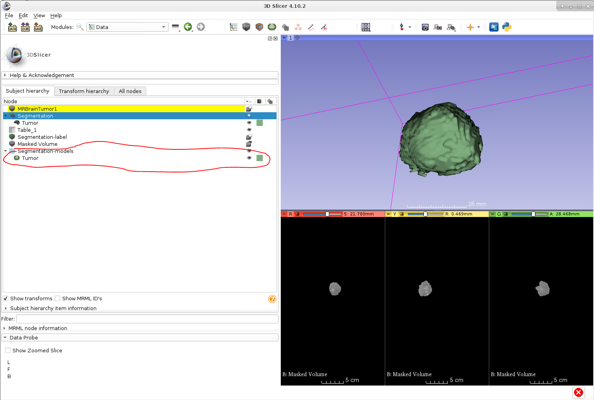

Models module, a shortcut with a green mesh icon in the core modules toolbar, is similar to Segmentations or Volumes module. It lets you explore the properties of this data type and change visualization settings. You can turn the visibility on and off, change the opacity, see the data properties: in this case, how many cells (polygons) and points there are in your Model, its volume and surface area. 

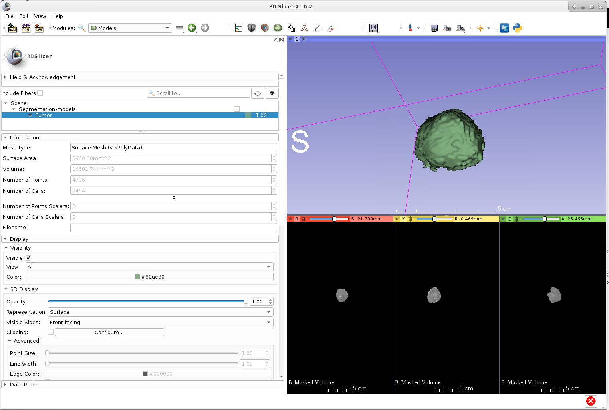

Play with the representation setting. Your model is a mesh. It has points and polygons. The default setting is to show the surfaces (polygons) but not the points or edges. You can change it if you'd like but surface is really the best visualization for this data. Seeing points and edges gives you an idea how "precise" your data is. It is ultimately based on the quality of the volume data you produced this mesh from. 

Another hidden setting here may change your life: the Visible Sides. With this smooth closed surface of the tumor, it is not easy to appreciate because all faces are pointing outwards. From your imaging basics lecture, remember that each cell/polygon has a normal vector and it defines the front face of the mesh. By changing which sides are visible, you can change what you are seeing dramatically. Play with it. And remember this setting when you load a mesh/model and think it looks degenerated. Probably part of it is not visualized becasue of this setting. 

There is a Clipping option. When you enable it, and click on Configure, it takes you down to the advance settings where you can select which slice you want to use for clipping. Then by simply changing the location of the slice from slice views, you can clip the Model visualization - not the Model itself. 

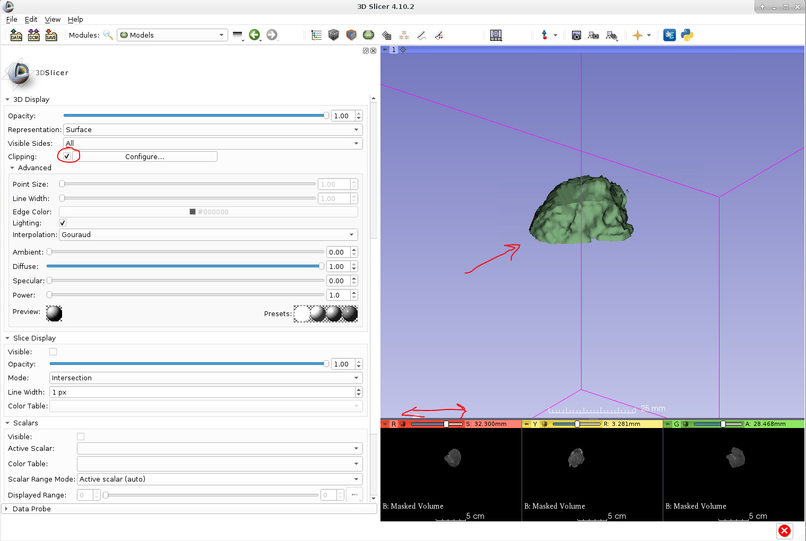

While the model is clipped, try changing the visile faces from Front to Back and to All. Rotate mesh to see what is visualized. 

Finally there are more settings to change the lighting and slice visualization. 

## Surface Toolbox

The module for simple processing of models is the *Surface Toolbox*. Similar to Segment Editor but really really limited capabilities. 

:pencil2: Find and open Surface Toolbox module. Select your new Model (mine is named Tumor) as the input and select the option to create a new model as output. 

Let's go over what you can do with surface toolbox:
 * Decimation: Reduces number of cells and points by averaging - similar to resizing an image.
 * Smoothing
 * Normals: Here auto-orient tries to orient the front-facing and back-facing cells so that normals are all pointing outside. This is not trivial when you have complex anatomical structures. You can also flip normals so front-facing ones are facing back. Splitting is a kind of smoothing operation where you split the cells with an angle beyond the feature angle you provide. 
* Mirror
* Clean: Sometimes surface meshes have points and stripts that do not belong to a polygon that are leftover from other operations. Cleaning, in essence, deals with data stored in the mesh. 
* Fill Holes
* Connectivity: Similar to Islands effect in Segment Editor but only with "keep largest" option. 

If your data is suitable for surface model conversion and your analysis needs mesh editing, try more advanced and specialized mesh editors like [MeshLab](http://www.meshlab.net/) or [Blender](https://www.blender.org/)

* also relevant Segment Mesher extension 

## Useful Links

* [Segmentation Recipes](https://github.com/lassoan/SlicerSegmentationRecipes) from Andras Lasso, PerkLab
* Bonus pointer to [discussion on Segmentation to Finite Element Analysis](https://discourse.slicer.org/t/use-segmentations-in-cad-or-fem-software/1626) 
