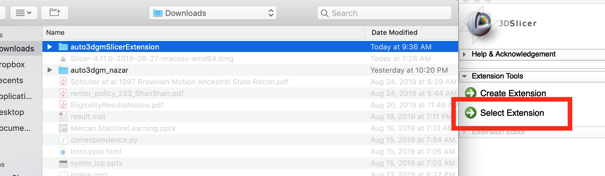
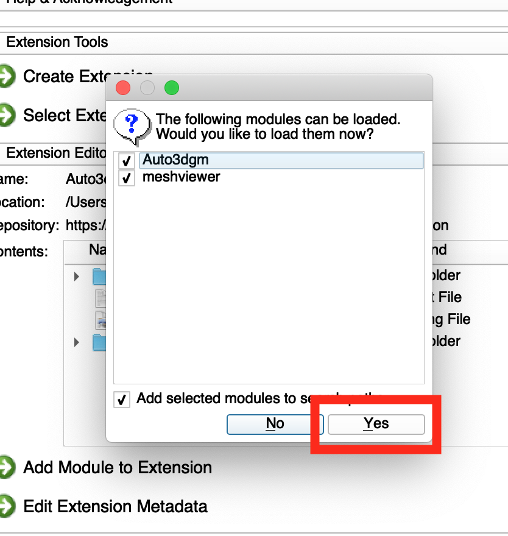
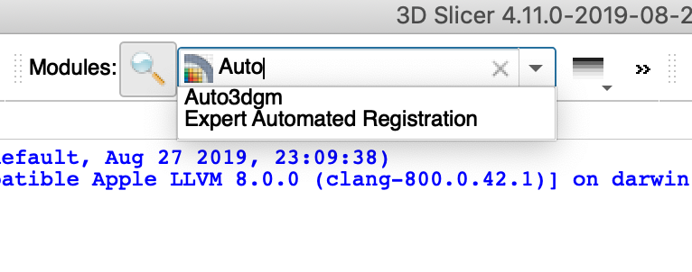
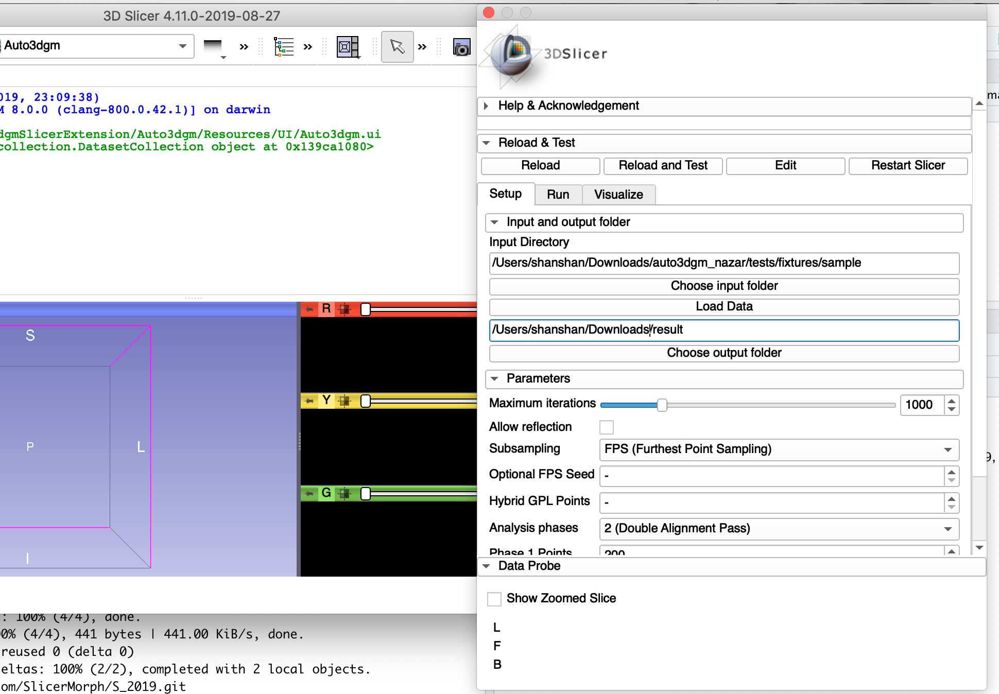
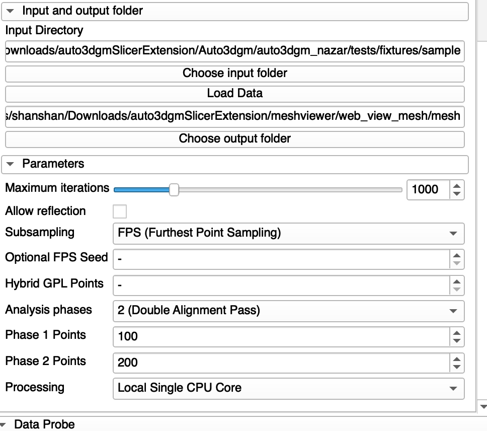
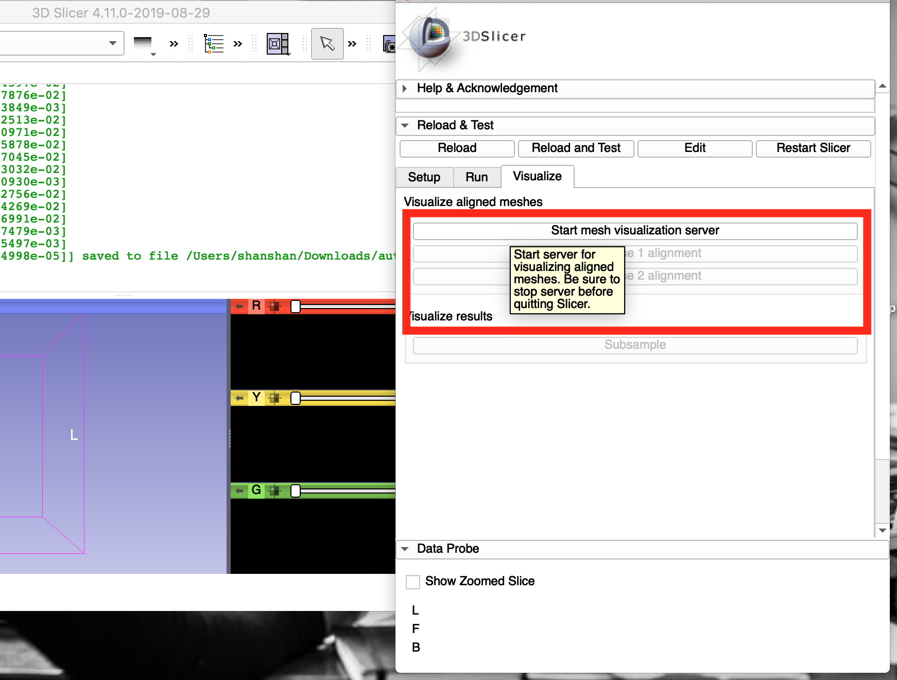
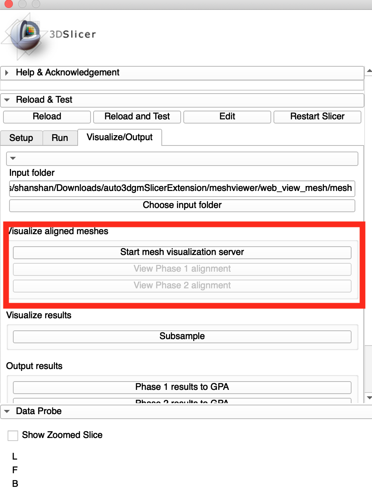
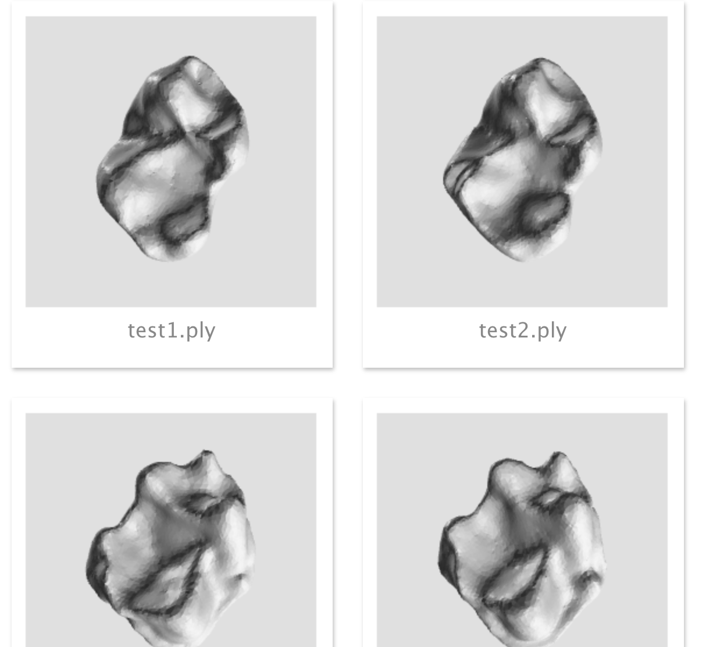

# Lab 09 Auto3Dgm: Establishing Landmark-free correspondence 
### Date: 08/29
### Time: 2 hours

## Objectives 
* become familiar auto3dgm slicer extension
* be able to use auto3dgm in slicer

## Prerequisite
Download and install [slicer](https://download.slicer.org/)

## How to install auto3dgm extension
### Install dependencies manually:
1) Open a terminal in your computer and type the following: 
- Mac: 

        /Applications/Slicer.app/Contents/bin/SlicerPython -m pip install scipy
        /Applications/Slicer.app/Contents/bin/SlicerPython -m pip install -f https://download.mosek.com/stable/wheel/index.html Mosek
        
- Windows:
- Linux: 

### Download and set up the extension

2) Inside the the terminal, type the following to dowload the extension:

        git clone --recursive https://github.com/ToothAndClaw/auto3dgmSlicerExtension

## How to use auto3dgm in slicer
1) Open Slicer, and select Extension Wizard

2) Click **Select Extension** and choose the folder auto3dgmSlicerExtension

3) Click *yes* to load Auto3dgm and webviewer modules

4) Load the module Auto3dgm to Slicer

5) You will see this UI popped up on your screen

5) In the UI, choose the input folder. We provide a sample data of 4 mandibular teeth to experiment in the lab. 

        ./auto3dgmSlicerExtension/Auto3dgm/auto3dgm_nazar/tests/fixtures/sample
        
6) Choose the output folder to be the following in order to visualize the aligned meshes

        ./auto3dgmSlicerExtension/meshviewer/web_view_mesh/mesh

7) Set **Phase 1 points** to be 100 and **Phase 2 points** to be 200

8) Run auto3dgm in the **Run** tab

## Visualize aligned meshes
1) In the **Visualize/Output** tab, select the input folder to be 

        ./auto3dgmSlicerExtension/meshviewer/web_view_mesh/mesh
2) Click **Start mesh visualization server**

3) Click **View Phase 1 alignment**

4) The aligned meshese will be shown in a pop-up browser window like the following

## Auto3dgm in other platforms
1) [Matlab](https://github.com/JuliaWinchester/auto3dgm-matlab-gorgon)
2) [R](https://github.com/sayanmuk/Auto3DGM)

## Futurework for Auto3dgm Slicer
1) Improve optimization speed
2) Parallel and GPU computing
3) Improve visualization for minimum spanning tree and aligned meshes

