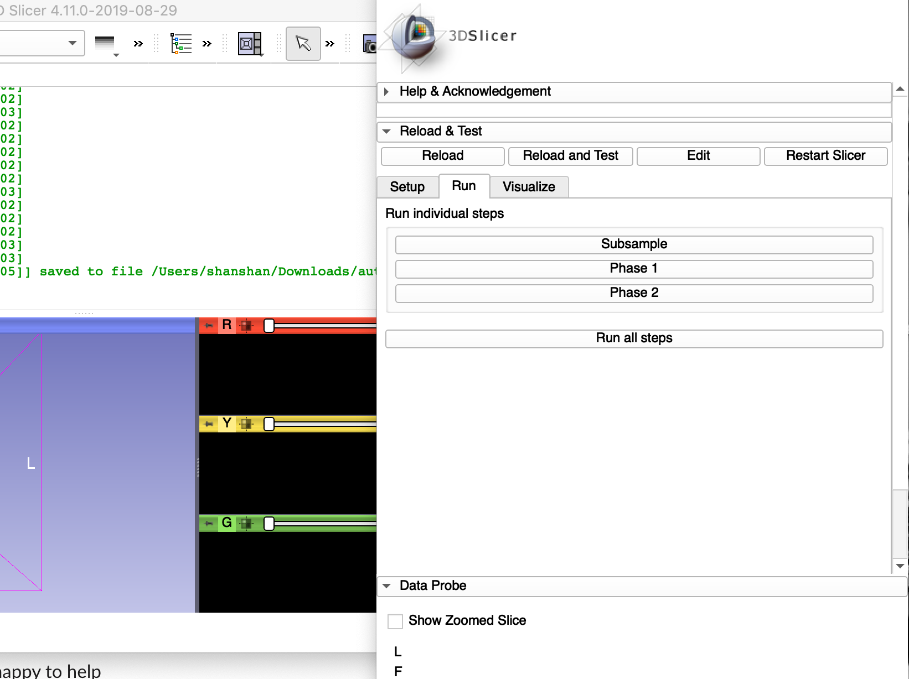

# Lab 09 Auto3Dgm: Establishing Landmark-free correspondence 
### Date: 08/30
### Time: 2 hours

## Objectives 
* become familiar auto3dgm slicer extension
* be able to use auto3dgm in slicer

## Prerequisite
Download and install [slicer](https://download.slicer.org/)

## How to install auto3dgm extension
### Install dependencies manually:
0) Open Slicer and type in the python interactor
            
            pip_install("scipy")
            pip_install("mosek")
            
If the above failed, do the following
1) Open a terminal in your computer and type the following: 
- Mac: 

        /Applications/Slicer.app/Contents/bin/SlicerPython -m pip install scipy
        /Applications/Slicer.app/Contents/bin/SlicerPython -m pip install -f https://download.mosek.com/stable/wheel/index.html Mosek
        
- Linux:

        <Slicer_install_dir>/bin/SlicerPython -m pip install scipy
        <Slicer_install_dir>/bin/SlicerPython -m pip install -f https://download.mosek.com/stable/wheel/index.html Mosek
        
- Windows: 

        <drive, e.g. c:>\Users\<user>\AppData\Local\NA-MIC\<Slicer version name>\bin\SlicerPython.exe -m pip install scipy
        <drive, e.g. c:>\Users\<user>\AppData\Local\NA-MIC\<Slicer version name>\bin\SlicerPython.exe -m pip install -f https://download.mosek.com/stable/wheel/index.html Mosek
        
- Windows option 2
        
        c:\Program Files\Slicer <version>\bin\SlicerPython.exe -m pip install scipy
        c:\Program Files\Slicer <version>\bin\SlicerPython.exe -m pip install -f https://download.mosek.com/stable/wheel/index.html Mosek
        
The slicer_install_dir can be found by the following steps:

a) Open slicer
b) type in the Python Interactor

        import os
        cwd = os.getcwd()
        print(cwd)

### Download and set up the extension

2) Inside the the terminal, type the following to download the extension:

        git clone --recursive https://github.com/ToothAndClaw/auto3dgmSlicerExtension

## How to use auto3dgm in slicer
1) Open Slicer, and select Extension Wizard


2) Click **Select Extension** and choose the folder auto3dgmSlicerExtension


3) Click *yes* to load Auto3dgm and webviewer modules


4) Load the module Auto3dgm to Slicer


5) You will see this UI popped up on your screen


5) In the UI, choose the input folder by either selecting the folder or type in the address box. We provide a sample data of 4 mandibular teeth to experiment in the lab. 

        ./auto3dgmSlicerExtension/Auto3dgm/auto3dgm_nazar/tests/fixtures/sample
        
6) Choose your output folder to save the aligned meshes and visualize the aligned meshes

        ./auto3dgmSlicerExtension/meshviewer/web_view_mesh/mesh

7) Set **Phase 1 points** to be 100 and **Phase 2 points** to be 200

8) Run auto3dgm in the **Run** tab



## Visualize aligned meshes
1) Click **Start mesh visualization server**

2) Click **View Phase 1 alignment**


3) The aligned meshese will be shown in a pop-up browser window like the following


4) Click **View Phase 2 alignment** to view the final alignment

## Update Auto3dgm Slicer Extension
1) Open a terminal in your computer and change directory ( `cd` ) to the folder where you downloaded the Auto3dgm Extension
```
cd auto3dgmSlicerExtension
```

2) Type in the terminal
```
git pull
```

3) To update submodules, type in the terminal
```
cd meshviewer/web_view_mesh
git submodule update --init --recursive
cd ../../Auto3dgm/auto3dgm_nazar
git submodule update --init --recursive
```

4) Use Extension Wizard to install Auto3dgm Slicer extension again. 

## Auto3dgm in other platforms
1) [Matlab](https://github.com/JuliaWinchester/auto3dgm-matlab-gorgon)
2) [R](https://github.com/sayanmuk/Auto3DGM)

## Futurework for Auto3dgm Slicer
1) Improve optimization speed
2) Parallel and GPU computing
3) Improve visualization for minimum spanning tree and aligned meshes


