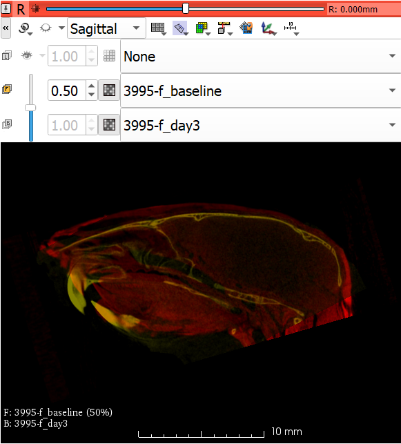
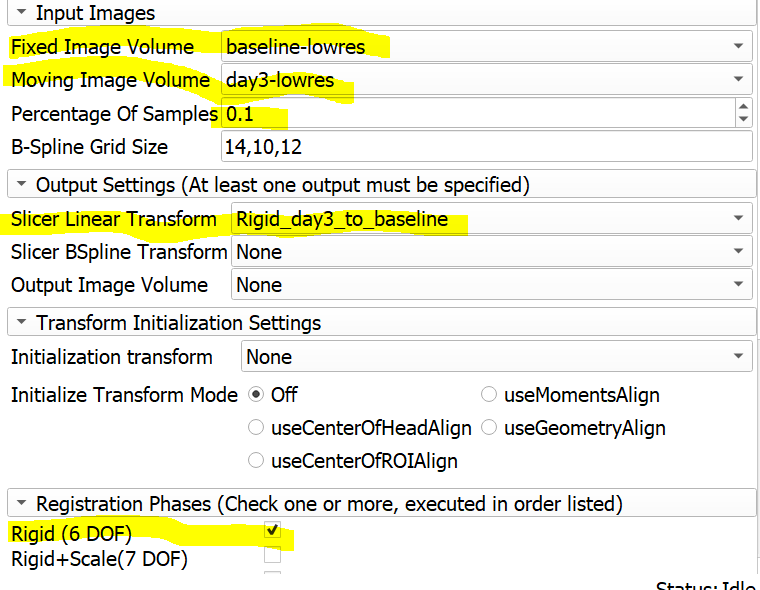
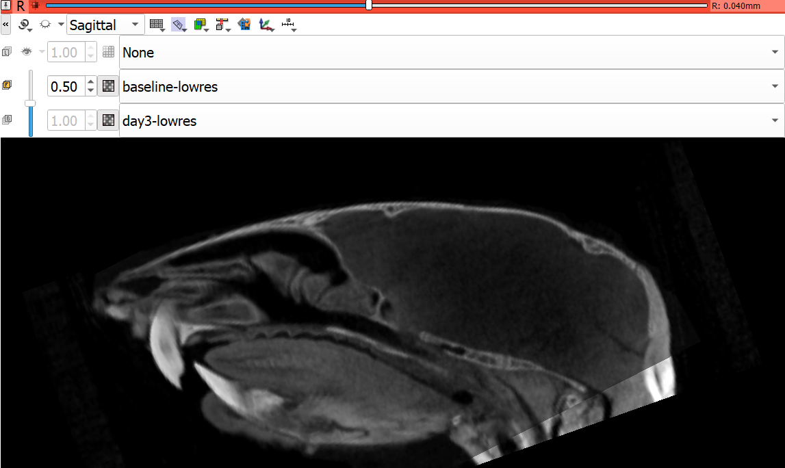
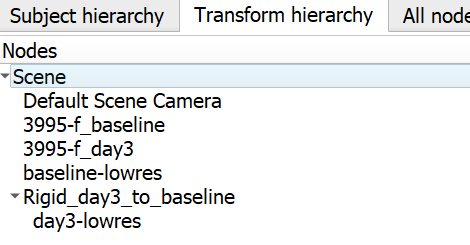
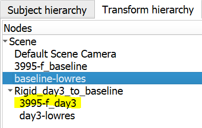
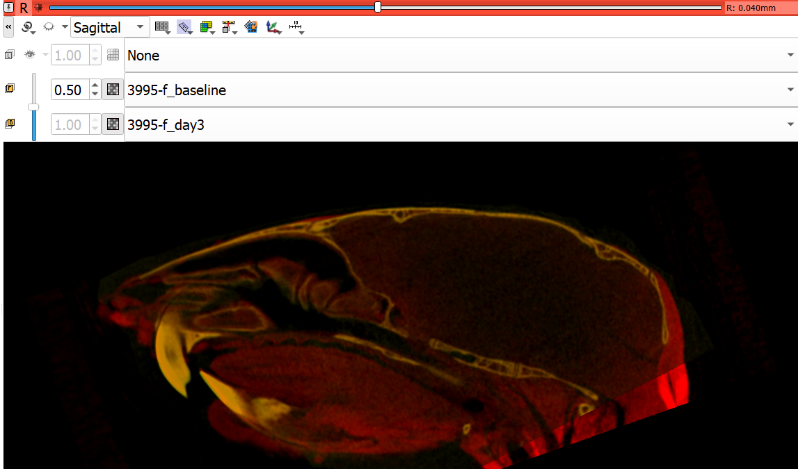

# Mini Lab for Image Registration
We will use two scans of the same mouse head (a baseline, and contrast enhanced scan after 3 days of lugol treatment), and superimpose them. 

Please find the datasets under *Lab03_Exercise\Registration_example*
1. 3995-f_baseline.nrrd
2. 3995-f_day3.nrrd 

and drag'n'drop them into Slicer. 

* as shown in previous labs, use the `Volumes` module to change the look up tables for either volume. Set the baseline to yellow and the day_3 scan to red. 
* adjust the foreground and background volumes in the slices viewers such that you can see both volumes at the same time. 
* go through the stack in different planes and note that while orientations are somewhat similar, they are not identical. 

* Go to `ResampleScalarVolume` module, and create low-resolution version of both volumes by entering the spacing 0.1x0.1x0.1mm. I used volume names *baseline-lowres* and *day3-lowres*. We are doing this step so that image registration works more quickly, and doesn't use too much memory. 

* Search for `General Registration (BRAINS)` module, and enter the settings as shown in the picture below:

Setting here indicates that the day3-lowres image is going to be registered against the baseline_lowres and the resultant *Rigid* transformation will be saved into the scene as *Rigid_day3_to_baseline*. Once settings are correct hit apply, in my computer registration takes about 15 seconds, and when it finishes, it will automatically update the slice views to show the *day3-lowres* under this linear transformation. 
* Set the *baseline-lowres* as the foreground image and use slice sliders and different view to see how well the two volumes are now superimposed.

 

* Because low-resolution volumes are actually in the same coordinate space as the original volumes, we can indeed apply this transformation to the origin *3995-f_day3* volume and review the alignment. To do that:
* Go to the `Data` module, instead of `Subject Hierarchy` tab switch to `Transform Hierarchy` and expand the *Rigid_day3_to_baseline* transformation, and drag *3995-f_day3* under it. This will apply the rigid transformation to the original full-resolution volume.

* Adjust the foreground and background volumes such that instead of low-resolution versions, you are looking the original volumes. 

 

## Questions: 
What do you think you need to save from this scene? 
Try running the registration with the same settings on the original volumes, how long did it take, it is any better?
