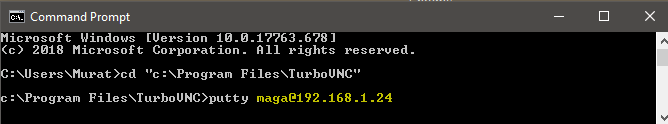
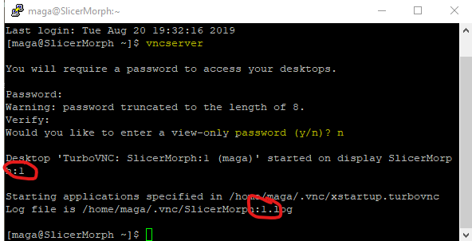
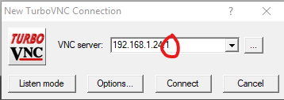
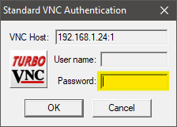
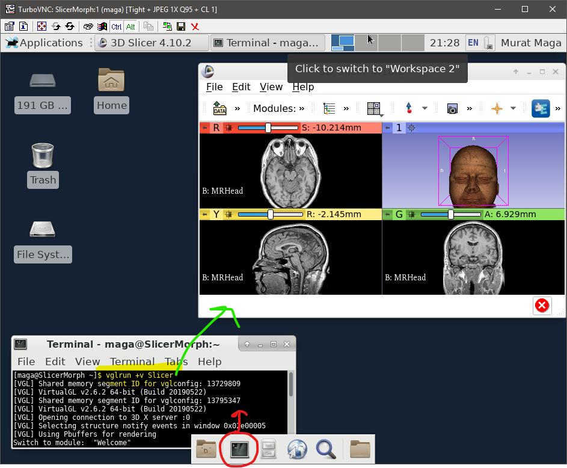

# Follow these instructions, if you would like to use the remote server for 3D Slicer
**You will need:**

* [to install TurboVNC for your OS](https://sourceforge.net/projects/turbovnc/files/)
* the user name, password and server IP address provided in your workshop package. 

**For Windows:**

1. Open command prompt (cmd.exe)
2. Navigate to the folder where TurboVNC installed by typing
```
cd "c:\program files\TurboVNC\"
```
3. In the command prompt, enter the command:
```
putty USERNAME@SERVERIP
```
where USERNAME and SERVERIP are the provided username and IP address in your workshop package.


</br>

4. Enter your password in the putty window. You should be now logged into the server
5. In the putty window, enter the command:
```
vncserver
```
If this is the first time you are doing this, you will need to set up a vnc password for yourself. You can answer 'no' to the question about view-only password. This will be the password you will enter to the vncviewer in step 7.

Make a note of the output, as you will need the VNC screen number (value after column **:** see the screen capture below) 
</br>


6. Start the vncviewer.exe from the Start Menu and type in the 
```
SERVERIP:PORT
```
where PORT is the value from the output of your vncserver command in step 5.
</br>


7. Make sure to enter the vnc password you set in step 5. 
</br>



**You should now be connected to the Linux Desktop in the vncviewer and can close the putty and command prompt windows**

**Steps 1-5 needs to be done only once (unless the remote server needs to be restarted or the vncserver crashes for some reason). You can safely disconnect and reconnect to your remote session with the vncviewer using the same IP address and PORT combination.**


8. To start Slicer or Rstudio, open a terminal window and type:
```
vglrun +v Slicer 
```

**important note:** Any application you are running and any dataset you loaded will remain in the memory, when you disconnect from the remote session. Remember that you are on a multi-user environment with shared resources, if you are not actively using Slicer, please make sure to close the Slicer window as a courtesy to others prior to disconnecting from vncviewer.**


